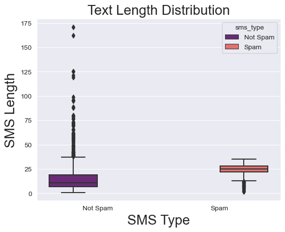
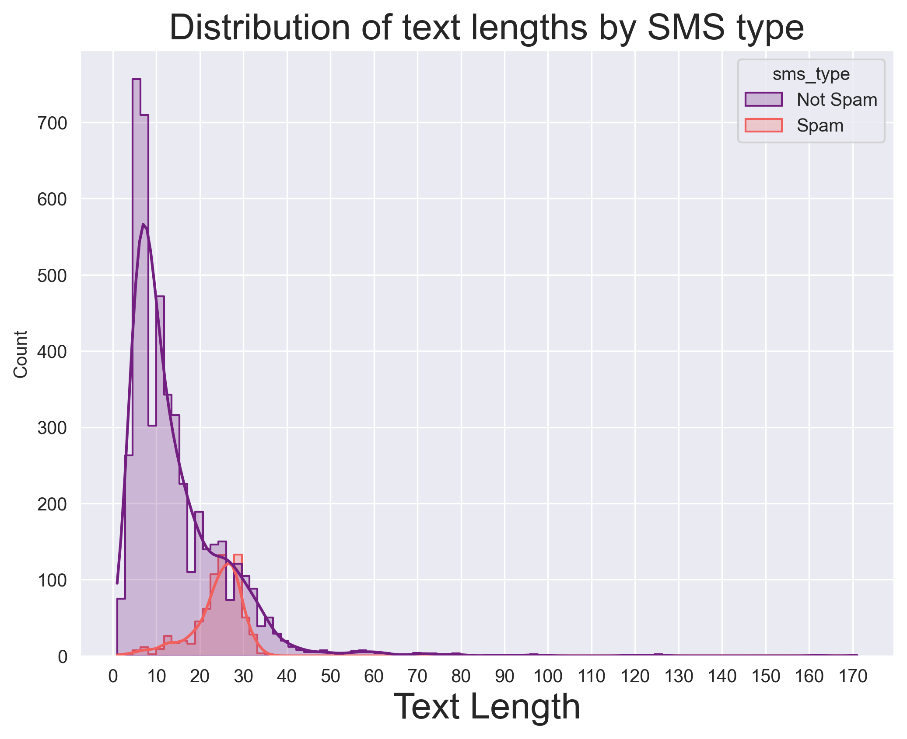
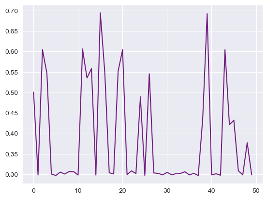
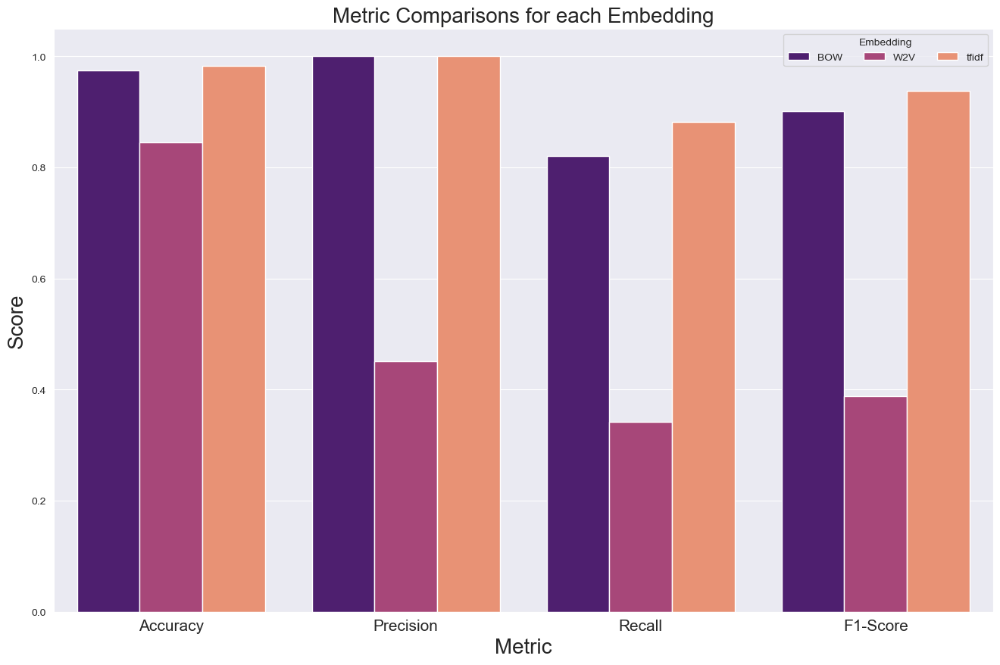
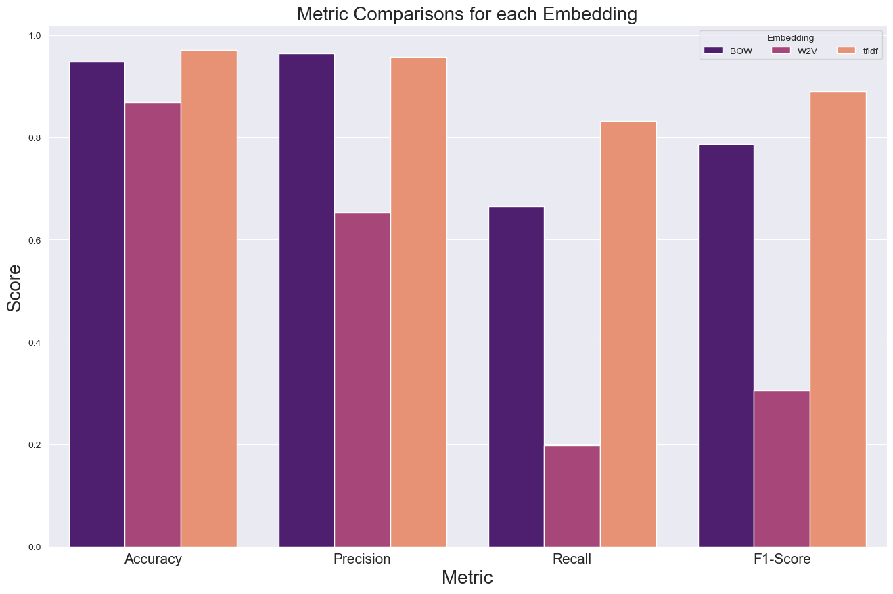

```python
import pandas as pd
import numpy as np
import warnings
import seaborn as sns
import matplotlib.pyplot as plt
warnings.filterwarnings("ignore")
```


```python
pwd
```


    '/Users/abhiramreddy/Downloads'


```python
data = pd.read_csv('train.csv')
data.head()

```


<div>
<style scoped>
    .dataframe tbody tr th:only-of-type {
        vertical-align: middle;
    }

    .dataframe tbody tr th {
        vertical-align: top;
    }

    .dataframe thead th {
        text-align: right;
    }
</style>
<table border="1" class="dataframe">
  <thead>
    <tr style="text-align: right;">
      <th></th>
      <th>sms</th>
      <th>label</th>
    </tr>
  </thead>
  <tbody>
    <tr>
      <th>0</th>
      <td>Go until jurong point, crazy.. Available only ...</td>
      <td>0</td>
    </tr>
    <tr>
      <th>1</th>
      <td>Ok lar... Joking wif u oni...\n</td>
      <td>0</td>
    </tr>
    <tr>
      <th>2</th>
      <td>Free entry in 2 a wkly comp to win FA Cup fina...</td>
      <td>1</td>
    </tr>
    <tr>
      <th>3</th>
      <td>U dun say so early hor... U c already then say...</td>
      <td>0</td>
    </tr>
    <tr>
      <th>4</th>
      <td>Nah I don't think he goes to usf, he lives aro...</td>
      <td>0</td>
    </tr>
  </tbody>
</table>
</div>


### How many samples of each class do we have?


```python
data.label.value_counts()
```


    0    4827
    1     747
    Name: label, dtype: int64


```python
round(100 * data.label.value_counts() / data.label.value_counts().sum(),2)
```


    0    86.6
    1    13.4
    Name: label, dtype: float64


#### 85% of all data are not spam and around 15% are spam

#### Removing special Characters


```python
import re

def remove_special_characters(input_string):
    # Define a regex pattern to match special characters (anything that is not a letter or a digit)
    pattern = r'[^a-zA-Z0-9\s]'
    
    # Use the sub() function to replace all matches with an empty string
    result = re.sub(pattern, '', input_string)
    
    return result
```


```python
data['sms'] = data.sms.map(lambda x: remove_special_characters(x))
```


```python
data['sms_type'] = data.label.map(lambda x : "Spam" if x == 1 else "Not Spam") 
```

### Let us look at the length of these messages


```python
data['length'] = data.sms.map(lambda x: len(x.strip('\n').split(' ')))
```


```python
sns.set_style('darkgrid')
red_palette = sns.color_palette("magma", 2)
sns.set_palette(red_palette)
sns.boxplot(data = data, y = 'length',x='sms_type',hue='sms_type')
plt.xlabel("SMS Type",size=20)
plt.ylabel("SMS Length",size=20)
plt.title('Text Length Distribution',size=20)
plt.show()
```


    

    


### What does the length distribution look for each sms type?


```python
plt.figure(figsize=(8, 6), dpi=300)
sns.histplot(data=data, x='length', hue='sms_type', kde=True, element='step')
plt.xlabel("Text Length",size=20)
plt.title("Distribution of text lengths by SMS type",size=20)
plt.xticks(np.arange(0,data.length.max(),10))
plt.show()
```


    

    


- Spam text are typically longer than Non-spam messages.
- Spam texts are usually 20 words or longer and Non-Spam messages are typically in the range of 1 to 20 words.

### Are there some frequently appearing words?
Let us look at the word cloud


```python
from wordcloud import WordCloud
non_spam_text = " ".join(data[data['label'] == 0]['sms'])
spam_text = " ".join(data[data['label'] == 1]['sms'])

non_spam_wordcloud = WordCloud(width=800, height=800, background_color='black').generate(non_spam_text)
spam_wordcloud = WordCloud(width=800, height=800, background_color='black').generate(spam_text)

non_spam_image = non_spam_wordcloud.to_array()
spam_image = spam_wordcloud.to_array()

plt.figure(figsize=(12, 6), dpi=600)

plt.subplot(1, 2, 1)
plt.imshow(non_spam_image, interpolation='bilinear')
plt.title('Ham Messages Word Cloud')
plt.axis('off')

plt.subplot(1, 2, 2)
plt.imshow(spam_image, interpolation='bilinear')
plt.title('Spam Messages Word Cloud')
plt.axis('off')

plt.tight_layout()
plt.show()
```


    

    


- Some very common Spam words seem to be "text", "call", "free", "now"

### Pre-processing

##### Remove stop words
We eliminate common words (stopwords) that do not contribute significantly to the meaning of the text.


```python
import nltk
from nltk.corpus import stopwords
```


```python
data['sms'] = data.sms.map(lambda words : ' '.join([x for x in words.split() if x not in stopwords.words("english")]))
```

#### Convert all text to lower case


```python
data['sms'] = data.sms.map(lambda x: x.lower())
```


```python
data
```


<div>
<style scoped>
    .dataframe tbody tr th:only-of-type {
        vertical-align: middle;
    }

    .dataframe tbody tr th {
        vertical-align: top;
    }

    .dataframe thead th {
        text-align: right;
    }
</style>
<table border="1" class="dataframe">
  <thead>
    <tr style="text-align: right;">
      <th></th>
      <th>sms</th>
      <th>label</th>
      <th>sms_type</th>
      <th>length</th>
    </tr>
  </thead>
  <tbody>
    <tr>
      <th>0</th>
      <td>go jurong point crazy available bugis n great ...</td>
      <td>0</td>
      <td>Not Spam</td>
      <td>20</td>
    </tr>
    <tr>
      <th>1</th>
      <td>ok lar joking wif u oni</td>
      <td>0</td>
      <td>Not Spam</td>
      <td>6</td>
    </tr>
    <tr>
      <th>2</th>
      <td>free entry 2 wkly comp win fa cup final tkts 2...</td>
      <td>1</td>
      <td>Spam</td>
      <td>28</td>
    </tr>
    <tr>
      <th>3</th>
      <td>u dun say early hor u c already say</td>
      <td>0</td>
      <td>Not Spam</td>
      <td>11</td>
    </tr>
    <tr>
      <th>4</th>
      <td>nah i dont think goes usf lives around though</td>
      <td>0</td>
      <td>Not Spam</td>
      <td>13</td>
    </tr>
    <tr>
      <th>...</th>
      <td>...</td>
      <td>...</td>
      <td>...</td>
      <td>...</td>
    </tr>
    <tr>
      <th>5569</th>
      <td>this 2nd time tried 2 contact u u 750 pound pr...</td>
      <td>1</td>
      <td>Spam</td>
      <td>30</td>
    </tr>
    <tr>
      <th>5570</th>
      <td>will b going esplanade fr home</td>
      <td>0</td>
      <td>Not Spam</td>
      <td>8</td>
    </tr>
    <tr>
      <th>5571</th>
      <td>pity mood soany suggestions</td>
      <td>0</td>
      <td>Not Spam</td>
      <td>10</td>
    </tr>
    <tr>
      <th>5572</th>
      <td>the guy bitching i acted like id interested bu...</td>
      <td>0</td>
      <td>Not Spam</td>
      <td>26</td>
    </tr>
    <tr>
      <th>5573</th>
      <td>rofl its true name</td>
      <td>0</td>
      <td>Not Spam</td>
      <td>6</td>
    </tr>
  </tbody>
</table>
<p>5574 rows × 4 columns</p>
</div>


### Lemmatization


```python
from nltk.stem import WordNetLemmatizer
nltk.download('wordnet')
lemmatizer = WordNetLemmatizer()
data['sms'] = data.sms.map(lambda x : ' '.join([lemmatizer.lemmatize(word) for word in x.split()]))

```

    [nltk_data] Downloading package wordnet to
    [nltk_data]     /Users/abhiramreddy/nltk_data...
    [nltk_data]   Package wordnet is already up-to-date!


#### Splitting our data into train-test


```python
X = data[['sms']]
y = data[['label']]
```


```python
from sklearn.model_selection import train_test_split
X_train, X_test, y_train, y_test = train_test_split(X, y, test_size=0.2, random_state=42)
```

### Let us train our model through various vectorization techniques

Word vectorization, also known as word embedding, is a fundamental technique in natural language processing (NLP) and machine learning. It involves representing words as numerical vectors in a high-dimensional space. There are several important reasons for performing word vectorization:

- <b>Machine Learning and NLP Tasks:</b> 
Many machine learning and NLP tasks require input data to be in numerical format. These tasks include text classification, sentiment analysis, machine translation, text generation, and more. Word vectorization is a crucial step in preparing textual data for these tasks.
- <b>Semantic Understanding:</b> 
Word vectorization captures semantic information about words. Words that have similar meanings or are used in similar contexts are represented as vectors that are close to each other in the vector space. This allows machine learning models to understand the relationships between words and make better predictions based on the context.
- <b>Reduced Dimensionality:</b> 
Traditional text representations, such as one-hot encoding, result in high-dimensional and sparse vectors. Word vectorization techniques, such as Word2Vec, GloVe, and FastText, map words to lower-dimensional dense vectors (e.g., 100 to 300 dimensions). This reduces the dimensionality of the data and helps in efficient storage and computation.
- <b>Improved Generalization:</b> 
Word vectors capture the distributional properties of words in a large corpus of text. This means that they can generalize well to unseen words or rare words because they learn from context. For example, even if a model has never seen the word "puppy," it can make educated guesses about its meaning if it has seen similar words like "dog" and "kitten."
- <b>Feature Engineering:</b> 
Word vectors can be used as features for machine learning models. Instead of using raw text data as input, models can use word vectors, which often result in improved model performance.
- <b>Word Similarity and Analogies:</b> 
Word vectors allow for operations like word similarity and analogies. For example, you can find words similar to "king" by calculating the cosine similarity between vectors or discover analogies like "king - man + woman = queen."
- <b>Transfer Learning:</b> 
Pre-trained word embeddings can be leveraged in transfer learning scenarios. Models trained on large text corpora to generate word vectors (e.g., Word2Vec or GloVe) can be fine-tuned on specific tasks with smaller datasets. This leverages the knowledge encoded in the word vectors.
- <b>Multilingual Support:</b> 
Word vectors can be generated for multiple languages, enabling NLP models to work with diverse text data.
- <b>Neural Network Inputs:</b> 
In deep learning models for NLP, such as recurrent neural networks (RNNs) and transformers, word vectors are often used as inputs to the models. These vectors help the models understand the meaning of words and the relationships between them.

In summary, word vectorization is a crucial step in NLP and machine learning, allowing textual data to be represented in a format suitable for computation and enabling models to understand the semantic relationships between words. It plays a pivotal role in a wide range of NLP applications and contributes to the success of many language-related tasks.

## Encoding

### 1. Bag of words


```python
from sklearn.feature_extraction.text import CountVectorizer
vectorizer = CountVectorizer(ngram_range=(2,2))
vectorizer.fit(X_train.sms)
#vectorizer.fit_transform(corpus)
```


<style>#sk-container-id-1 {color: black;}#sk-container-id-1 pre{padding: 0;}#sk-container-id-1 div.sk-toggleable {background-color: white;}#sk-container-id-1 label.sk-toggleable__label {cursor: pointer;display: block;width: 100%;margin-bottom: 0;padding: 0.3em;box-sizing: border-box;text-align: center;}#sk-container-id-1 label.sk-toggleable__label-arrow:before {content: "▸";float: left;margin-right: 0.25em;color: #696969;}#sk-container-id-1 label.sk-toggleable__label-arrow:hover:before {color: black;}#sk-container-id-1 div.sk-estimator:hover label.sk-toggleable__label-arrow:before {color: black;}#sk-container-id-1 div.sk-toggleable__content {max-height: 0;max-width: 0;overflow: hidden;text-align: left;background-color: #f0f8ff;}#sk-container-id-1 div.sk-toggleable__content pre {margin: 0.2em;color: black;border-radius: 0.25em;background-color: #f0f8ff;}#sk-container-id-1 input.sk-toggleable__control:checked~div.sk-toggleable__content {max-height: 200px;max-width: 100%;overflow: auto;}#sk-container-id-1 input.sk-toggleable__control:checked~label.sk-toggleable__label-arrow:before {content: "▾";}#sk-container-id-1 div.sk-estimator input.sk-toggleable__control:checked~label.sk-toggleable__label {background-color: #d4ebff;}#sk-container-id-1 div.sk-label input.sk-toggleable__control:checked~label.sk-toggleable__label {background-color: #d4ebff;}#sk-container-id-1 input.sk-hidden--visually {border: 0;clip: rect(1px 1px 1px 1px);clip: rect(1px, 1px, 1px, 1px);height: 1px;margin: -1px;overflow: hidden;padding: 0;position: absolute;width: 1px;}#sk-container-id-1 div.sk-estimator {font-family: monospace;background-color: #f0f8ff;border: 1px dotted black;border-radius: 0.25em;box-sizing: border-box;margin-bottom: 0.5em;}#sk-container-id-1 div.sk-estimator:hover {background-color: #d4ebff;}#sk-container-id-1 div.sk-parallel-item::after {content: "";width: 100%;border-bottom: 1px solid gray;flex-grow: 1;}#sk-container-id-1 div.sk-label:hover label.sk-toggleable__label {background-color: #d4ebff;}#sk-container-id-1 div.sk-serial::before {content: "";position: absolute;border-left: 1px solid gray;box-sizing: border-box;top: 0;bottom: 0;left: 50%;z-index: 0;}#sk-container-id-1 div.sk-serial {display: flex;flex-direction: column;align-items: center;background-color: white;padding-right: 0.2em;padding-left: 0.2em;position: relative;}#sk-container-id-1 div.sk-item {position: relative;z-index: 1;}#sk-container-id-1 div.sk-parallel {display: flex;align-items: stretch;justify-content: center;background-color: white;position: relative;}#sk-container-id-1 div.sk-item::before, #sk-container-id-1 div.sk-parallel-item::before {content: "";position: absolute;border-left: 1px solid gray;box-sizing: border-box;top: 0;bottom: 0;left: 50%;z-index: -1;}#sk-container-id-1 div.sk-parallel-item {display: flex;flex-direction: column;z-index: 1;position: relative;background-color: white;}#sk-container-id-1 div.sk-parallel-item:first-child::after {align-self: flex-end;width: 50%;}#sk-container-id-1 div.sk-parallel-item:last-child::after {align-self: flex-start;width: 50%;}#sk-container-id-1 div.sk-parallel-item:only-child::after {width: 0;}#sk-container-id-1 div.sk-dashed-wrapped {border: 1px dashed gray;margin: 0 0.4em 0.5em 0.4em;box-sizing: border-box;padding-bottom: 0.4em;background-color: white;}#sk-container-id-1 div.sk-label label {font-family: monospace;font-weight: bold;display: inline-block;line-height: 1.2em;}#sk-container-id-1 div.sk-label-container {text-align: center;}#sk-container-id-1 div.sk-container {/* jupyter's `normalize.less` sets `[hidden] { display: none; }` but bootstrap.min.css set `[hidden] { display: none !important; }` so we also need the `!important` here to be able to override the default hidden behavior on the sphinx rendered scikit-learn.org. See: https://github.com/scikit-learn/scikit-learn/issues/21755 */display: inline-block !important;position: relative;}#sk-container-id-1 div.sk-text-repr-fallback {display: none;}</style><div id="sk-container-id-1" class="sk-top-container"><div class="sk-text-repr-fallback"><pre>CountVectorizer(ngram_range=(2, 2))</pre><b>In a Jupyter environment, please rerun this cell to show the HTML representation or trust the notebook. <br />On GitHub, the HTML representation is unable to render, please try loading this page with nbviewer.org.</b></div><div class="sk-container" hidden><div class="sk-item"><div class="sk-estimator sk-toggleable"><input class="sk-toggleable__control sk-hidden--visually" id="sk-estimator-id-1" type="checkbox" checked><label for="sk-estimator-id-1" class="sk-toggleable__label sk-toggleable__label-arrow">CountVectorizer</label><div class="sk-toggleable__content"><pre>CountVectorizer(ngram_range=(2, 2))</pre></div></div></div></div></div>


```python
X_train_bow = vectorizer.transform(X_train.sms).toarray()
X_test_bow = vectorizer.transform(X_test.sms).toarray()
```

### 2. TF-Idf


```python
from sklearn.feature_extraction.text import TfidfVectorizer
tfidfvectorizer = TfidfVectorizer()
tfidfvectorizer.fit(X_train.sms)
X_train_tfidf = tfidfvectorizer.transform(X_train.sms)
X_test_tfidf = tfidfvectorizer.transform(X_test.sms)
```

### 3. Word2Vec


```python
from gensim.models import Word2Vec
```


```python
model = Word2Vec(X_train.sms, vector_size=1000, window=5, min_count=1, sg=1) # CBOW

```


```python
def compute_average_vector(document, model):
    word_vectors = []
    for word in document:
        if word in model.wv:
            word_vectors.append(model.wv[word])
    if word_vectors:
        return np.mean(word_vectors, axis=0)
    else:
        return np.zeros(model.vector_size)

# Apply the function to each document in the DataFrame
X_train_w2v = X_train["sms"].apply(lambda x: compute_average_vector(x.split(), model)).values.tolist()
X_test_w2v = X_test["sms"].apply(lambda x: compute_average_vector(x.split(), model)).values.tolist()
```

### Modelling

### Train and test models based on the embeddings created

#### Naive Bayes Classifer


```python
from sklearn.model_selection import RandomizedSearchCV
from sklearn.naive_bayes import MultinomialNB
from scipy.stats import uniform, randint

# Create a MultinomialNB classifier
nb = MultinomialNB()

# Define hyperparameter grid
param_dist = {
    'alpha': uniform(0.1, 2.0),  # Smoothing parameter (continuous uniform distribution)
    'fit_prior': [True, False],  # Whether to learn class prior probabilities
}

# Create RandomizedSearchCV object
random_search = RandomizedSearchCV(
    nb,
    param_distributions=param_dist,
    n_iter=50,  # Number of parameter settings to sample
    cv=5,        # Cross-validation folds
    scoring='f1',  # Scoring metric
    random_state=42,     # Random seed for reproducibility
    n_jobs=1,  # Use all available CPU cores
)
random_search.fit(X_train_bow, y_train)

```


<style>#sk-container-id-2 {color: black;}#sk-container-id-2 pre{padding: 0;}#sk-container-id-2 div.sk-toggleable {background-color: white;}#sk-container-id-2 label.sk-toggleable__label {cursor: pointer;display: block;width: 100%;margin-bottom: 0;padding: 0.3em;box-sizing: border-box;text-align: center;}#sk-container-id-2 label.sk-toggleable__label-arrow:before {content: "▸";float: left;margin-right: 0.25em;color: #696969;}#sk-container-id-2 label.sk-toggleable__label-arrow:hover:before {color: black;}#sk-container-id-2 div.sk-estimator:hover label.sk-toggleable__label-arrow:before {color: black;}#sk-container-id-2 div.sk-toggleable__content {max-height: 0;max-width: 0;overflow: hidden;text-align: left;background-color: #f0f8ff;}#sk-container-id-2 div.sk-toggleable__content pre {margin: 0.2em;color: black;border-radius: 0.25em;background-color: #f0f8ff;}#sk-container-id-2 input.sk-toggleable__control:checked~div.sk-toggleable__content {max-height: 200px;max-width: 100%;overflow: auto;}#sk-container-id-2 input.sk-toggleable__control:checked~label.sk-toggleable__label-arrow:before {content: "▾";}#sk-container-id-2 div.sk-estimator input.sk-toggleable__control:checked~label.sk-toggleable__label {background-color: #d4ebff;}#sk-container-id-2 div.sk-label input.sk-toggleable__control:checked~label.sk-toggleable__label {background-color: #d4ebff;}#sk-container-id-2 input.sk-hidden--visually {border: 0;clip: rect(1px 1px 1px 1px);clip: rect(1px, 1px, 1px, 1px);height: 1px;margin: -1px;overflow: hidden;padding: 0;position: absolute;width: 1px;}#sk-container-id-2 div.sk-estimator {font-family: monospace;background-color: #f0f8ff;border: 1px dotted black;border-radius: 0.25em;box-sizing: border-box;margin-bottom: 0.5em;}#sk-container-id-2 div.sk-estimator:hover {background-color: #d4ebff;}#sk-container-id-2 div.sk-parallel-item::after {content: "";width: 100%;border-bottom: 1px solid gray;flex-grow: 1;}#sk-container-id-2 div.sk-label:hover label.sk-toggleable__label {background-color: #d4ebff;}#sk-container-id-2 div.sk-serial::before {content: "";position: absolute;border-left: 1px solid gray;box-sizing: border-box;top: 0;bottom: 0;left: 50%;z-index: 0;}#sk-container-id-2 div.sk-serial {display: flex;flex-direction: column;align-items: center;background-color: white;padding-right: 0.2em;padding-left: 0.2em;position: relative;}#sk-container-id-2 div.sk-item {position: relative;z-index: 1;}#sk-container-id-2 div.sk-parallel {display: flex;align-items: stretch;justify-content: center;background-color: white;position: relative;}#sk-container-id-2 div.sk-item::before, #sk-container-id-2 div.sk-parallel-item::before {content: "";position: absolute;border-left: 1px solid gray;box-sizing: border-box;top: 0;bottom: 0;left: 50%;z-index: -1;}#sk-container-id-2 div.sk-parallel-item {display: flex;flex-direction: column;z-index: 1;position: relative;background-color: white;}#sk-container-id-2 div.sk-parallel-item:first-child::after {align-self: flex-end;width: 50%;}#sk-container-id-2 div.sk-parallel-item:last-child::after {align-self: flex-start;width: 50%;}#sk-container-id-2 div.sk-parallel-item:only-child::after {width: 0;}#sk-container-id-2 div.sk-dashed-wrapped {border: 1px dashed gray;margin: 0 0.4em 0.5em 0.4em;box-sizing: border-box;padding-bottom: 0.4em;background-color: white;}#sk-container-id-2 div.sk-label label {font-family: monospace;font-weight: bold;display: inline-block;line-height: 1.2em;}#sk-container-id-2 div.sk-label-container {text-align: center;}#sk-container-id-2 div.sk-container {/* jupyter's `normalize.less` sets `[hidden] { display: none; }` but bootstrap.min.css set `[hidden] { display: none !important; }` so we also need the `!important` here to be able to override the default hidden behavior on the sphinx rendered scikit-learn.org. See: https://github.com/scikit-learn/scikit-learn/issues/21755 */display: inline-block !important;position: relative;}#sk-container-id-2 div.sk-text-repr-fallback {display: none;}</style><div id="sk-container-id-2" class="sk-top-container"><div class="sk-text-repr-fallback"><pre>RandomizedSearchCV(cv=5, estimator=MultinomialNB(), n_iter=50, n_jobs=1,
                   param_distributions={&#x27;alpha&#x27;: &lt;scipy.stats._distn_infrastructure.rv_continuous_frozen object at 0x2ef417d50&gt;,
                                        &#x27;fit_prior&#x27;: [True, False]},
                   random_state=42, scoring=&#x27;f1&#x27;)</pre><b>In a Jupyter environment, please rerun this cell to show the HTML representation or trust the notebook. <br />On GitHub, the HTML representation is unable to render, please try loading this page with nbviewer.org.</b></div><div class="sk-container" hidden><div class="sk-item sk-dashed-wrapped"><div class="sk-label-container"><div class="sk-label sk-toggleable"><input class="sk-toggleable__control sk-hidden--visually" id="sk-estimator-id-2" type="checkbox" ><label for="sk-estimator-id-2" class="sk-toggleable__label sk-toggleable__label-arrow">RandomizedSearchCV</label><div class="sk-toggleable__content"><pre>RandomizedSearchCV(cv=5, estimator=MultinomialNB(), n_iter=50, n_jobs=1,
                   param_distributions={&#x27;alpha&#x27;: &lt;scipy.stats._distn_infrastructure.rv_continuous_frozen object at 0x2ef417d50&gt;,
                                        &#x27;fit_prior&#x27;: [True, False]},
                   random_state=42, scoring=&#x27;f1&#x27;)</pre></div></div></div><div class="sk-parallel"><div class="sk-parallel-item"><div class="sk-item"><div class="sk-label-container"><div class="sk-label sk-toggleable"><input class="sk-toggleable__control sk-hidden--visually" id="sk-estimator-id-3" type="checkbox" ><label for="sk-estimator-id-3" class="sk-toggleable__label sk-toggleable__label-arrow">estimator: MultinomialNB</label><div class="sk-toggleable__content"><pre>MultinomialNB()</pre></div></div></div><div class="sk-serial"><div class="sk-item"><div class="sk-estimator sk-toggleable"><input class="sk-toggleable__control sk-hidden--visually" id="sk-estimator-id-4" type="checkbox" ><label for="sk-estimator-id-4" class="sk-toggleable__label sk-toggleable__label-arrow">MultinomialNB</label><div class="sk-toggleable__content"><pre>MultinomialNB()</pre></div></div></div></div></div></div></div></div></div></div>


```python
random_search.best_estimator_
```


<style>#sk-container-id-3 {color: black;}#sk-container-id-3 pre{padding: 0;}#sk-container-id-3 div.sk-toggleable {background-color: white;}#sk-container-id-3 label.sk-toggleable__label {cursor: pointer;display: block;width: 100%;margin-bottom: 0;padding: 0.3em;box-sizing: border-box;text-align: center;}#sk-container-id-3 label.sk-toggleable__label-arrow:before {content: "▸";float: left;margin-right: 0.25em;color: #696969;}#sk-container-id-3 label.sk-toggleable__label-arrow:hover:before {color: black;}#sk-container-id-3 div.sk-estimator:hover label.sk-toggleable__label-arrow:before {color: black;}#sk-container-id-3 div.sk-toggleable__content {max-height: 0;max-width: 0;overflow: hidden;text-align: left;background-color: #f0f8ff;}#sk-container-id-3 div.sk-toggleable__content pre {margin: 0.2em;color: black;border-radius: 0.25em;background-color: #f0f8ff;}#sk-container-id-3 input.sk-toggleable__control:checked~div.sk-toggleable__content {max-height: 200px;max-width: 100%;overflow: auto;}#sk-container-id-3 input.sk-toggleable__control:checked~label.sk-toggleable__label-arrow:before {content: "▾";}#sk-container-id-3 div.sk-estimator input.sk-toggleable__control:checked~label.sk-toggleable__label {background-color: #d4ebff;}#sk-container-id-3 div.sk-label input.sk-toggleable__control:checked~label.sk-toggleable__label {background-color: #d4ebff;}#sk-container-id-3 input.sk-hidden--visually {border: 0;clip: rect(1px 1px 1px 1px);clip: rect(1px, 1px, 1px, 1px);height: 1px;margin: -1px;overflow: hidden;padding: 0;position: absolute;width: 1px;}#sk-container-id-3 div.sk-estimator {font-family: monospace;background-color: #f0f8ff;border: 1px dotted black;border-radius: 0.25em;box-sizing: border-box;margin-bottom: 0.5em;}#sk-container-id-3 div.sk-estimator:hover {background-color: #d4ebff;}#sk-container-id-3 div.sk-parallel-item::after {content: "";width: 100%;border-bottom: 1px solid gray;flex-grow: 1;}#sk-container-id-3 div.sk-label:hover label.sk-toggleable__label {background-color: #d4ebff;}#sk-container-id-3 div.sk-serial::before {content: "";position: absolute;border-left: 1px solid gray;box-sizing: border-box;top: 0;bottom: 0;left: 50%;z-index: 0;}#sk-container-id-3 div.sk-serial {display: flex;flex-direction: column;align-items: center;background-color: white;padding-right: 0.2em;padding-left: 0.2em;position: relative;}#sk-container-id-3 div.sk-item {position: relative;z-index: 1;}#sk-container-id-3 div.sk-parallel {display: flex;align-items: stretch;justify-content: center;background-color: white;position: relative;}#sk-container-id-3 div.sk-item::before, #sk-container-id-3 div.sk-parallel-item::before {content: "";position: absolute;border-left: 1px solid gray;box-sizing: border-box;top: 0;bottom: 0;left: 50%;z-index: -1;}#sk-container-id-3 div.sk-parallel-item {display: flex;flex-direction: column;z-index: 1;position: relative;background-color: white;}#sk-container-id-3 div.sk-parallel-item:first-child::after {align-self: flex-end;width: 50%;}#sk-container-id-3 div.sk-parallel-item:last-child::after {align-self: flex-start;width: 50%;}#sk-container-id-3 div.sk-parallel-item:only-child::after {width: 0;}#sk-container-id-3 div.sk-dashed-wrapped {border: 1px dashed gray;margin: 0 0.4em 0.5em 0.4em;box-sizing: border-box;padding-bottom: 0.4em;background-color: white;}#sk-container-id-3 div.sk-label label {font-family: monospace;font-weight: bold;display: inline-block;line-height: 1.2em;}#sk-container-id-3 div.sk-label-container {text-align: center;}#sk-container-id-3 div.sk-container {/* jupyter's `normalize.less` sets `[hidden] { display: none; }` but bootstrap.min.css set `[hidden] { display: none !important; }` so we also need the `!important` here to be able to override the default hidden behavior on the sphinx rendered scikit-learn.org. See: https://github.com/scikit-learn/scikit-learn/issues/21755 */display: inline-block !important;position: relative;}#sk-container-id-3 div.sk-text-repr-fallback {display: none;}</style><div id="sk-container-id-3" class="sk-top-container"><div class="sk-text-repr-fallback"><pre>MultinomialNB(alpha=2.047511037682918)</pre><b>In a Jupyter environment, please rerun this cell to show the HTML representation or trust the notebook. <br />On GitHub, the HTML representation is unable to render, please try loading this page with nbviewer.org.</b></div><div class="sk-container" hidden><div class="sk-item"><div class="sk-estimator sk-toggleable"><input class="sk-toggleable__control sk-hidden--visually" id="sk-estimator-id-5" type="checkbox" checked><label for="sk-estimator-id-5" class="sk-toggleable__label sk-toggleable__label-arrow">MultinomialNB</label><div class="sk-toggleable__content"><pre>MultinomialNB(alpha=2.047511037682918)</pre></div></div></div></div></div>


```python
best_nv_bow = random_search.best_estimator_
best_nv_bow.fit(X_train_bow, y_train)
y_pred_bow = best_nv_bow.predict(X_test_bow)
```


```python
plt.plot(random_search.cv_results_.get('mean_test_score'))
```


    [<matplotlib.lines.Line2D at 0x29ecb7190>]


    

    


```python
list(random_search.cv_results_.get('rank_test_score')).index(1)
```


    15


```python
from sklearn.model_selection import RandomizedSearchCV
from sklearn.naive_bayes import MultinomialNB
from scipy.stats import uniform, randint

# Create a MultinomialNB classifier
nb = MultinomialNB()

# Define hyperparameter grid
param_dist = {
    'alpha': uniform(0.1, 2.0),  # Smoothing parameter (continuous uniform distribution)
    'fit_prior': [True, False],  # Whether to learn class prior probabilities
}

# Create RandomizedSearchCV object
random_search = RandomizedSearchCV(
    nb,
    param_distributions=param_dist,
    n_iter=50,  # Number of parameter settings to sample
    cv=5,        # Cross-validation folds
    scoring='f1',  # Scoring metric
    random_state=42,     # Random seed for reproducibility
    n_jobs=1,  # Use all available CPU cores
)
random_search.fit(X_train_tfidf, y_train)

```


<style>#sk-container-id-4 {color: black;}#sk-container-id-4 pre{padding: 0;}#sk-container-id-4 div.sk-toggleable {background-color: white;}#sk-container-id-4 label.sk-toggleable__label {cursor: pointer;display: block;width: 100%;margin-bottom: 0;padding: 0.3em;box-sizing: border-box;text-align: center;}#sk-container-id-4 label.sk-toggleable__label-arrow:before {content: "▸";float: left;margin-right: 0.25em;color: #696969;}#sk-container-id-4 label.sk-toggleable__label-arrow:hover:before {color: black;}#sk-container-id-4 div.sk-estimator:hover label.sk-toggleable__label-arrow:before {color: black;}#sk-container-id-4 div.sk-toggleable__content {max-height: 0;max-width: 0;overflow: hidden;text-align: left;background-color: #f0f8ff;}#sk-container-id-4 div.sk-toggleable__content pre {margin: 0.2em;color: black;border-radius: 0.25em;background-color: #f0f8ff;}#sk-container-id-4 input.sk-toggleable__control:checked~div.sk-toggleable__content {max-height: 200px;max-width: 100%;overflow: auto;}#sk-container-id-4 input.sk-toggleable__control:checked~label.sk-toggleable__label-arrow:before {content: "▾";}#sk-container-id-4 div.sk-estimator input.sk-toggleable__control:checked~label.sk-toggleable__label {background-color: #d4ebff;}#sk-container-id-4 div.sk-label input.sk-toggleable__control:checked~label.sk-toggleable__label {background-color: #d4ebff;}#sk-container-id-4 input.sk-hidden--visually {border: 0;clip: rect(1px 1px 1px 1px);clip: rect(1px, 1px, 1px, 1px);height: 1px;margin: -1px;overflow: hidden;padding: 0;position: absolute;width: 1px;}#sk-container-id-4 div.sk-estimator {font-family: monospace;background-color: #f0f8ff;border: 1px dotted black;border-radius: 0.25em;box-sizing: border-box;margin-bottom: 0.5em;}#sk-container-id-4 div.sk-estimator:hover {background-color: #d4ebff;}#sk-container-id-4 div.sk-parallel-item::after {content: "";width: 100%;border-bottom: 1px solid gray;flex-grow: 1;}#sk-container-id-4 div.sk-label:hover label.sk-toggleable__label {background-color: #d4ebff;}#sk-container-id-4 div.sk-serial::before {content: "";position: absolute;border-left: 1px solid gray;box-sizing: border-box;top: 0;bottom: 0;left: 50%;z-index: 0;}#sk-container-id-4 div.sk-serial {display: flex;flex-direction: column;align-items: center;background-color: white;padding-right: 0.2em;padding-left: 0.2em;position: relative;}#sk-container-id-4 div.sk-item {position: relative;z-index: 1;}#sk-container-id-4 div.sk-parallel {display: flex;align-items: stretch;justify-content: center;background-color: white;position: relative;}#sk-container-id-4 div.sk-item::before, #sk-container-id-4 div.sk-parallel-item::before {content: "";position: absolute;border-left: 1px solid gray;box-sizing: border-box;top: 0;bottom: 0;left: 50%;z-index: -1;}#sk-container-id-4 div.sk-parallel-item {display: flex;flex-direction: column;z-index: 1;position: relative;background-color: white;}#sk-container-id-4 div.sk-parallel-item:first-child::after {align-self: flex-end;width: 50%;}#sk-container-id-4 div.sk-parallel-item:last-child::after {align-self: flex-start;width: 50%;}#sk-container-id-4 div.sk-parallel-item:only-child::after {width: 0;}#sk-container-id-4 div.sk-dashed-wrapped {border: 1px dashed gray;margin: 0 0.4em 0.5em 0.4em;box-sizing: border-box;padding-bottom: 0.4em;background-color: white;}#sk-container-id-4 div.sk-label label {font-family: monospace;font-weight: bold;display: inline-block;line-height: 1.2em;}#sk-container-id-4 div.sk-label-container {text-align: center;}#sk-container-id-4 div.sk-container {/* jupyter's `normalize.less` sets `[hidden] { display: none; }` but bootstrap.min.css set `[hidden] { display: none !important; }` so we also need the `!important` here to be able to override the default hidden behavior on the sphinx rendered scikit-learn.org. See: https://github.com/scikit-learn/scikit-learn/issues/21755 */display: inline-block !important;position: relative;}#sk-container-id-4 div.sk-text-repr-fallback {display: none;}</style><div id="sk-container-id-4" class="sk-top-container"><div class="sk-text-repr-fallback"><pre>RandomizedSearchCV(cv=5, estimator=MultinomialNB(), n_iter=50, n_jobs=1,
                   param_distributions={&#x27;alpha&#x27;: &lt;scipy.stats._distn_infrastructure.rv_continuous_frozen object at 0x2ef50c4d0&gt;,
                                        &#x27;fit_prior&#x27;: [True, False]},
                   random_state=42, scoring=&#x27;f1&#x27;)</pre><b>In a Jupyter environment, please rerun this cell to show the HTML representation or trust the notebook. <br />On GitHub, the HTML representation is unable to render, please try loading this page with nbviewer.org.</b></div><div class="sk-container" hidden><div class="sk-item sk-dashed-wrapped"><div class="sk-label-container"><div class="sk-label sk-toggleable"><input class="sk-toggleable__control sk-hidden--visually" id="sk-estimator-id-6" type="checkbox" ><label for="sk-estimator-id-6" class="sk-toggleable__label sk-toggleable__label-arrow">RandomizedSearchCV</label><div class="sk-toggleable__content"><pre>RandomizedSearchCV(cv=5, estimator=MultinomialNB(), n_iter=50, n_jobs=1,
                   param_distributions={&#x27;alpha&#x27;: &lt;scipy.stats._distn_infrastructure.rv_continuous_frozen object at 0x2ef50c4d0&gt;,
                                        &#x27;fit_prior&#x27;: [True, False]},
                   random_state=42, scoring=&#x27;f1&#x27;)</pre></div></div></div><div class="sk-parallel"><div class="sk-parallel-item"><div class="sk-item"><div class="sk-label-container"><div class="sk-label sk-toggleable"><input class="sk-toggleable__control sk-hidden--visually" id="sk-estimator-id-7" type="checkbox" ><label for="sk-estimator-id-7" class="sk-toggleable__label sk-toggleable__label-arrow">estimator: MultinomialNB</label><div class="sk-toggleable__content"><pre>MultinomialNB()</pre></div></div></div><div class="sk-serial"><div class="sk-item"><div class="sk-estimator sk-toggleable"><input class="sk-toggleable__control sk-hidden--visually" id="sk-estimator-id-8" type="checkbox" ><label for="sk-estimator-id-8" class="sk-toggleable__label sk-toggleable__label-arrow">MultinomialNB</label><div class="sk-toggleable__content"><pre>MultinomialNB()</pre></div></div></div></div></div></div></div></div></div></div>


```python
random_search.best_estimator_
```


<style>#sk-container-id-5 {color: black;}#sk-container-id-5 pre{padding: 0;}#sk-container-id-5 div.sk-toggleable {background-color: white;}#sk-container-id-5 label.sk-toggleable__label {cursor: pointer;display: block;width: 100%;margin-bottom: 0;padding: 0.3em;box-sizing: border-box;text-align: center;}#sk-container-id-5 label.sk-toggleable__label-arrow:before {content: "▸";float: left;margin-right: 0.25em;color: #696969;}#sk-container-id-5 label.sk-toggleable__label-arrow:hover:before {color: black;}#sk-container-id-5 div.sk-estimator:hover label.sk-toggleable__label-arrow:before {color: black;}#sk-container-id-5 div.sk-toggleable__content {max-height: 0;max-width: 0;overflow: hidden;text-align: left;background-color: #f0f8ff;}#sk-container-id-5 div.sk-toggleable__content pre {margin: 0.2em;color: black;border-radius: 0.25em;background-color: #f0f8ff;}#sk-container-id-5 input.sk-toggleable__control:checked~div.sk-toggleable__content {max-height: 200px;max-width: 100%;overflow: auto;}#sk-container-id-5 input.sk-toggleable__control:checked~label.sk-toggleable__label-arrow:before {content: "▾";}#sk-container-id-5 div.sk-estimator input.sk-toggleable__control:checked~label.sk-toggleable__label {background-color: #d4ebff;}#sk-container-id-5 div.sk-label input.sk-toggleable__control:checked~label.sk-toggleable__label {background-color: #d4ebff;}#sk-container-id-5 input.sk-hidden--visually {border: 0;clip: rect(1px 1px 1px 1px);clip: rect(1px, 1px, 1px, 1px);height: 1px;margin: -1px;overflow: hidden;padding: 0;position: absolute;width: 1px;}#sk-container-id-5 div.sk-estimator {font-family: monospace;background-color: #f0f8ff;border: 1px dotted black;border-radius: 0.25em;box-sizing: border-box;margin-bottom: 0.5em;}#sk-container-id-5 div.sk-estimator:hover {background-color: #d4ebff;}#sk-container-id-5 div.sk-parallel-item::after {content: "";width: 100%;border-bottom: 1px solid gray;flex-grow: 1;}#sk-container-id-5 div.sk-label:hover label.sk-toggleable__label {background-color: #d4ebff;}#sk-container-id-5 div.sk-serial::before {content: "";position: absolute;border-left: 1px solid gray;box-sizing: border-box;top: 0;bottom: 0;left: 50%;z-index: 0;}#sk-container-id-5 div.sk-serial {display: flex;flex-direction: column;align-items: center;background-color: white;padding-right: 0.2em;padding-left: 0.2em;position: relative;}#sk-container-id-5 div.sk-item {position: relative;z-index: 1;}#sk-container-id-5 div.sk-parallel {display: flex;align-items: stretch;justify-content: center;background-color: white;position: relative;}#sk-container-id-5 div.sk-item::before, #sk-container-id-5 div.sk-parallel-item::before {content: "";position: absolute;border-left: 1px solid gray;box-sizing: border-box;top: 0;bottom: 0;left: 50%;z-index: -1;}#sk-container-id-5 div.sk-parallel-item {display: flex;flex-direction: column;z-index: 1;position: relative;background-color: white;}#sk-container-id-5 div.sk-parallel-item:first-child::after {align-self: flex-end;width: 50%;}#sk-container-id-5 div.sk-parallel-item:last-child::after {align-self: flex-start;width: 50%;}#sk-container-id-5 div.sk-parallel-item:only-child::after {width: 0;}#sk-container-id-5 div.sk-dashed-wrapped {border: 1px dashed gray;margin: 0 0.4em 0.5em 0.4em;box-sizing: border-box;padding-bottom: 0.4em;background-color: white;}#sk-container-id-5 div.sk-label label {font-family: monospace;font-weight: bold;display: inline-block;line-height: 1.2em;}#sk-container-id-5 div.sk-label-container {text-align: center;}#sk-container-id-5 div.sk-container {/* jupyter's `normalize.less` sets `[hidden] { display: none; }` but bootstrap.min.css set `[hidden] { display: none !important; }` so we also need the `!important` here to be able to override the default hidden behavior on the sphinx rendered scikit-learn.org. See: https://github.com/scikit-learn/scikit-learn/issues/21755 */display: inline-block !important;position: relative;}#sk-container-id-5 div.sk-text-repr-fallback {display: none;}</style><div id="sk-container-id-5" class="sk-top-container"><div class="sk-text-repr-fallback"><pre>MultinomialNB(alpha=0.1110442342472048)</pre><b>In a Jupyter environment, please rerun this cell to show the HTML representation or trust the notebook. <br />On GitHub, the HTML representation is unable to render, please try loading this page with nbviewer.org.</b></div><div class="sk-container" hidden><div class="sk-item"><div class="sk-estimator sk-toggleable"><input class="sk-toggleable__control sk-hidden--visually" id="sk-estimator-id-9" type="checkbox" checked><label for="sk-estimator-id-9" class="sk-toggleable__label sk-toggleable__label-arrow">MultinomialNB</label><div class="sk-toggleable__content"><pre>MultinomialNB(alpha=0.1110442342472048)</pre></div></div></div></div></div>


```python
list(random_search.cv_results_.get('rank_test_score')).index(1)
```


    48


```python
best_nv_tfidf = random_search.best_estimator_
best_nv_tfidf.fit(X_train_tfidf, y_train)
y_pred_tfidf = best_nv_tfidf.predict(X_test_tfidf)
```


```python
# nb = MultinomialNB(alpha=0.1) #alpha=0.1 is more accurate for our model
# nb.fit(X_train_tfidf, y_train)
# y_pred_tfidf = nb.predict(X_test_tfidf)

```


```python
from sklearn.model_selection import RandomizedSearchCV
from sklearn.naive_bayes import BernoulliNB
from scipy.stats import uniform, randint

# Create a BernoulliNB classifier
nb_classifier = BernoulliNB()

# Define hyperparameter grid
param_dist = {
    'alpha': uniform(0.1, 2.0),  # Smoothing parameter (continuous uniform distribution)
    'binarize': uniform(0.0, 1.0),  # Binarization threshold (continuous uniform distribution)
    'fit_prior': [True, False],  # Whether to learn class prior probabilities
}

# Create RandomizedSearchCV object
random_search = RandomizedSearchCV(
    nb_classifier,
    param_distributions=param_dist,
    n_iter=50,  # Number of parameter settings to sample
    cv=5,        # Cross-validation folds
    scoring='f1',  # Scoring metric
    random_state=42,     # Random seed for reproducibility
    n_jobs=1,  # Use all available CPU cores
)

# Fit the RandomizedSearchCV object to your data
random_search.fit(X_train_w2v, y_train)
```


<style>#sk-container-id-6 {color: black;}#sk-container-id-6 pre{padding: 0;}#sk-container-id-6 div.sk-toggleable {background-color: white;}#sk-container-id-6 label.sk-toggleable__label {cursor: pointer;display: block;width: 100%;margin-bottom: 0;padding: 0.3em;box-sizing: border-box;text-align: center;}#sk-container-id-6 label.sk-toggleable__label-arrow:before {content: "▸";float: left;margin-right: 0.25em;color: #696969;}#sk-container-id-6 label.sk-toggleable__label-arrow:hover:before {color: black;}#sk-container-id-6 div.sk-estimator:hover label.sk-toggleable__label-arrow:before {color: black;}#sk-container-id-6 div.sk-toggleable__content {max-height: 0;max-width: 0;overflow: hidden;text-align: left;background-color: #f0f8ff;}#sk-container-id-6 div.sk-toggleable__content pre {margin: 0.2em;color: black;border-radius: 0.25em;background-color: #f0f8ff;}#sk-container-id-6 input.sk-toggleable__control:checked~div.sk-toggleable__content {max-height: 200px;max-width: 100%;overflow: auto;}#sk-container-id-6 input.sk-toggleable__control:checked~label.sk-toggleable__label-arrow:before {content: "▾";}#sk-container-id-6 div.sk-estimator input.sk-toggleable__control:checked~label.sk-toggleable__label {background-color: #d4ebff;}#sk-container-id-6 div.sk-label input.sk-toggleable__control:checked~label.sk-toggleable__label {background-color: #d4ebff;}#sk-container-id-6 input.sk-hidden--visually {border: 0;clip: rect(1px 1px 1px 1px);clip: rect(1px, 1px, 1px, 1px);height: 1px;margin: -1px;overflow: hidden;padding: 0;position: absolute;width: 1px;}#sk-container-id-6 div.sk-estimator {font-family: monospace;background-color: #f0f8ff;border: 1px dotted black;border-radius: 0.25em;box-sizing: border-box;margin-bottom: 0.5em;}#sk-container-id-6 div.sk-estimator:hover {background-color: #d4ebff;}#sk-container-id-6 div.sk-parallel-item::after {content: "";width: 100%;border-bottom: 1px solid gray;flex-grow: 1;}#sk-container-id-6 div.sk-label:hover label.sk-toggleable__label {background-color: #d4ebff;}#sk-container-id-6 div.sk-serial::before {content: "";position: absolute;border-left: 1px solid gray;box-sizing: border-box;top: 0;bottom: 0;left: 50%;z-index: 0;}#sk-container-id-6 div.sk-serial {display: flex;flex-direction: column;align-items: center;background-color: white;padding-right: 0.2em;padding-left: 0.2em;position: relative;}#sk-container-id-6 div.sk-item {position: relative;z-index: 1;}#sk-container-id-6 div.sk-parallel {display: flex;align-items: stretch;justify-content: center;background-color: white;position: relative;}#sk-container-id-6 div.sk-item::before, #sk-container-id-6 div.sk-parallel-item::before {content: "";position: absolute;border-left: 1px solid gray;box-sizing: border-box;top: 0;bottom: 0;left: 50%;z-index: -1;}#sk-container-id-6 div.sk-parallel-item {display: flex;flex-direction: column;z-index: 1;position: relative;background-color: white;}#sk-container-id-6 div.sk-parallel-item:first-child::after {align-self: flex-end;width: 50%;}#sk-container-id-6 div.sk-parallel-item:last-child::after {align-self: flex-start;width: 50%;}#sk-container-id-6 div.sk-parallel-item:only-child::after {width: 0;}#sk-container-id-6 div.sk-dashed-wrapped {border: 1px dashed gray;margin: 0 0.4em 0.5em 0.4em;box-sizing: border-box;padding-bottom: 0.4em;background-color: white;}#sk-container-id-6 div.sk-label label {font-family: monospace;font-weight: bold;display: inline-block;line-height: 1.2em;}#sk-container-id-6 div.sk-label-container {text-align: center;}#sk-container-id-6 div.sk-container {/* jupyter's `normalize.less` sets `[hidden] { display: none; }` but bootstrap.min.css set `[hidden] { display: none !important; }` so we also need the `!important` here to be able to override the default hidden behavior on the sphinx rendered scikit-learn.org. See: https://github.com/scikit-learn/scikit-learn/issues/21755 */display: inline-block !important;position: relative;}#sk-container-id-6 div.sk-text-repr-fallback {display: none;}</style><div id="sk-container-id-6" class="sk-top-container"><div class="sk-text-repr-fallback"><pre>RandomizedSearchCV(cv=5, estimator=BernoulliNB(), n_iter=50, n_jobs=1,
                   param_distributions={&#x27;alpha&#x27;: &lt;scipy.stats._distn_infrastructure.rv_continuous_frozen object at 0x2ef5b0bd0&gt;,
                                        &#x27;binarize&#x27;: &lt;scipy.stats._distn_infrastructure.rv_continuous_frozen object at 0x2ef5b1ad0&gt;,
                                        &#x27;fit_prior&#x27;: [True, False]},
                   random_state=42, scoring=&#x27;f1&#x27;)</pre><b>In a Jupyter environment, please rerun this cell to show the HTML representation or trust the notebook. <br />On GitHub, the HTML representation is unable to render, please try loading this page with nbviewer.org.</b></div><div class="sk-container" hidden><div class="sk-item sk-dashed-wrapped"><div class="sk-label-container"><div class="sk-label sk-toggleable"><input class="sk-toggleable__control sk-hidden--visually" id="sk-estimator-id-10" type="checkbox" ><label for="sk-estimator-id-10" class="sk-toggleable__label sk-toggleable__label-arrow">RandomizedSearchCV</label><div class="sk-toggleable__content"><pre>RandomizedSearchCV(cv=5, estimator=BernoulliNB(), n_iter=50, n_jobs=1,
                   param_distributions={&#x27;alpha&#x27;: &lt;scipy.stats._distn_infrastructure.rv_continuous_frozen object at 0x2ef5b0bd0&gt;,
                                        &#x27;binarize&#x27;: &lt;scipy.stats._distn_infrastructure.rv_continuous_frozen object at 0x2ef5b1ad0&gt;,
                                        &#x27;fit_prior&#x27;: [True, False]},
                   random_state=42, scoring=&#x27;f1&#x27;)</pre></div></div></div><div class="sk-parallel"><div class="sk-parallel-item"><div class="sk-item"><div class="sk-label-container"><div class="sk-label sk-toggleable"><input class="sk-toggleable__control sk-hidden--visually" id="sk-estimator-id-11" type="checkbox" ><label for="sk-estimator-id-11" class="sk-toggleable__label sk-toggleable__label-arrow">estimator: BernoulliNB</label><div class="sk-toggleable__content"><pre>BernoulliNB()</pre></div></div></div><div class="sk-serial"><div class="sk-item"><div class="sk-estimator sk-toggleable"><input class="sk-toggleable__control sk-hidden--visually" id="sk-estimator-id-12" type="checkbox" ><label for="sk-estimator-id-12" class="sk-toggleable__label sk-toggleable__label-arrow">BernoulliNB</label><div class="sk-toggleable__content"><pre>BernoulliNB()</pre></div></div></div></div></div></div></div></div></div></div>


```python
random_search.best_estimator_
```


<style>#sk-container-id-7 {color: black;}#sk-container-id-7 pre{padding: 0;}#sk-container-id-7 div.sk-toggleable {background-color: white;}#sk-container-id-7 label.sk-toggleable__label {cursor: pointer;display: block;width: 100%;margin-bottom: 0;padding: 0.3em;box-sizing: border-box;text-align: center;}#sk-container-id-7 label.sk-toggleable__label-arrow:before {content: "▸";float: left;margin-right: 0.25em;color: #696969;}#sk-container-id-7 label.sk-toggleable__label-arrow:hover:before {color: black;}#sk-container-id-7 div.sk-estimator:hover label.sk-toggleable__label-arrow:before {color: black;}#sk-container-id-7 div.sk-toggleable__content {max-height: 0;max-width: 0;overflow: hidden;text-align: left;background-color: #f0f8ff;}#sk-container-id-7 div.sk-toggleable__content pre {margin: 0.2em;color: black;border-radius: 0.25em;background-color: #f0f8ff;}#sk-container-id-7 input.sk-toggleable__control:checked~div.sk-toggleable__content {max-height: 200px;max-width: 100%;overflow: auto;}#sk-container-id-7 input.sk-toggleable__control:checked~label.sk-toggleable__label-arrow:before {content: "▾";}#sk-container-id-7 div.sk-estimator input.sk-toggleable__control:checked~label.sk-toggleable__label {background-color: #d4ebff;}#sk-container-id-7 div.sk-label input.sk-toggleable__control:checked~label.sk-toggleable__label {background-color: #d4ebff;}#sk-container-id-7 input.sk-hidden--visually {border: 0;clip: rect(1px 1px 1px 1px);clip: rect(1px, 1px, 1px, 1px);height: 1px;margin: -1px;overflow: hidden;padding: 0;position: absolute;width: 1px;}#sk-container-id-7 div.sk-estimator {font-family: monospace;background-color: #f0f8ff;border: 1px dotted black;border-radius: 0.25em;box-sizing: border-box;margin-bottom: 0.5em;}#sk-container-id-7 div.sk-estimator:hover {background-color: #d4ebff;}#sk-container-id-7 div.sk-parallel-item::after {content: "";width: 100%;border-bottom: 1px solid gray;flex-grow: 1;}#sk-container-id-7 div.sk-label:hover label.sk-toggleable__label {background-color: #d4ebff;}#sk-container-id-7 div.sk-serial::before {content: "";position: absolute;border-left: 1px solid gray;box-sizing: border-box;top: 0;bottom: 0;left: 50%;z-index: 0;}#sk-container-id-7 div.sk-serial {display: flex;flex-direction: column;align-items: center;background-color: white;padding-right: 0.2em;padding-left: 0.2em;position: relative;}#sk-container-id-7 div.sk-item {position: relative;z-index: 1;}#sk-container-id-7 div.sk-parallel {display: flex;align-items: stretch;justify-content: center;background-color: white;position: relative;}#sk-container-id-7 div.sk-item::before, #sk-container-id-7 div.sk-parallel-item::before {content: "";position: absolute;border-left: 1px solid gray;box-sizing: border-box;top: 0;bottom: 0;left: 50%;z-index: -1;}#sk-container-id-7 div.sk-parallel-item {display: flex;flex-direction: column;z-index: 1;position: relative;background-color: white;}#sk-container-id-7 div.sk-parallel-item:first-child::after {align-self: flex-end;width: 50%;}#sk-container-id-7 div.sk-parallel-item:last-child::after {align-self: flex-start;width: 50%;}#sk-container-id-7 div.sk-parallel-item:only-child::after {width: 0;}#sk-container-id-7 div.sk-dashed-wrapped {border: 1px dashed gray;margin: 0 0.4em 0.5em 0.4em;box-sizing: border-box;padding-bottom: 0.4em;background-color: white;}#sk-container-id-7 div.sk-label label {font-family: monospace;font-weight: bold;display: inline-block;line-height: 1.2em;}#sk-container-id-7 div.sk-label-container {text-align: center;}#sk-container-id-7 div.sk-container {/* jupyter's `normalize.less` sets `[hidden] { display: none; }` but bootstrap.min.css set `[hidden] { display: none !important; }` so we also need the `!important` here to be able to override the default hidden behavior on the sphinx rendered scikit-learn.org. See: https://github.com/scikit-learn/scikit-learn/issues/21755 */display: inline-block !important;position: relative;}#sk-container-id-7 div.sk-text-repr-fallback {display: none;}</style><div id="sk-container-id-7" class="sk-top-container"><div class="sk-text-repr-fallback"><pre>BernoulliNB(alpha=0.41198904067240527, binarize=0.05808361216819946,
            fit_prior=False)</pre><b>In a Jupyter environment, please rerun this cell to show the HTML representation or trust the notebook. <br />On GitHub, the HTML representation is unable to render, please try loading this page with nbviewer.org.</b></div><div class="sk-container" hidden><div class="sk-item"><div class="sk-estimator sk-toggleable"><input class="sk-toggleable__control sk-hidden--visually" id="sk-estimator-id-13" type="checkbox" checked><label for="sk-estimator-id-13" class="sk-toggleable__label sk-toggleable__label-arrow">BernoulliNB</label><div class="sk-toggleable__content"><pre>BernoulliNB(alpha=0.41198904067240527, binarize=0.05808361216819946,
            fit_prior=False)</pre></div></div></div></div></div>


```python
best_nv_w2v= random_search.best_estimator_
best_nv_w2v.fit(X_train_w2v, y_train)
y_pred_w2= best_nv_w2v.predict(X_test_w2v)
```


```python
# from sklearn.naive_bayes import BernoulliNB
# nb = BernoulliNB(alpha=1) #alpha=0.1 is more accurate for our model
# nb.fit(X_train_w2v, y_train)
# y_pred_w2 = nb.predict(X_test_w2v)

```


```python
from sklearn.metrics import accuracy_score, precision_score, recall_score, f1_score, confusion_matrix, classification_report, roc_curve, roc_auc_score

# True labels and predicted labels
predictions = {"BOW":y_pred_bow, "W2V":y_pred_w2, "tfidf":y_pred_tfidf}

y_true = y_test
results_1 = {"Embedding":[],"Accuracy":[],"Precision":[],"Recall":[],'F1-Score':[]}
for k,v in predictions.items():
    y_pred = v
    # Accuracy
    accuracy = accuracy_score(y_true, y_pred)
    results_1['Embedding'].append(k)
    results_1['Accuracy'].append(accuracy)
    # print(f"Accuracy: {accuracy:.2f}")
    
    # Precision
    precision = precision_score(y_true, y_pred)
    # print(f"Precision: {precision:.2f}")
    results_1['Precision'].append(precision)
    # Recall
    recall = recall_score(y_true, y_pred)
    # print(f"Recall: {recall:.2f}")
    results_1['Recall'].append(recall)
    # F1-Score
    f1 = f1_score(y_true, y_pred)
    results_1['F1-Score'].append(f1)
    # print(f"F1-Score: {f1:.2f}")
    
    # Confusion Matrix
    cm = confusion_matrix(y_true, y_pred)
    # print("Confusion Matrix:")
    # print(cm)
    
    # Classification Report
    # report = classification_report(y_true, y_pred)
    # print("Classification Report:")
    # print(report)

# ROC Curve and AUC

```


```python
pd.DataFrame(results_1)
```


<div>
<style scoped>
    .dataframe tbody tr th:only-of-type {
        vertical-align: middle;
    }

    .dataframe tbody tr th {
        vertical-align: top;
    }

    .dataframe thead th {
        text-align: right;
    }
</style>
<table border="1" class="dataframe">
  <thead>
    <tr style="text-align: right;">
      <th></th>
      <th>Embedding</th>
      <th>Accuracy</th>
      <th>Precision</th>
      <th>Recall</th>
      <th>F1-Score</th>
    </tr>
  </thead>
  <tbody>
    <tr>
      <th>0</th>
      <td>BOW</td>
      <td>0.973991</td>
      <td>1.00000</td>
      <td>0.819876</td>
      <td>0.901024</td>
    </tr>
    <tr>
      <th>1</th>
      <td>W2V</td>
      <td>0.844843</td>
      <td>0.45082</td>
      <td>0.341615</td>
      <td>0.388693</td>
    </tr>
    <tr>
      <th>2</th>
      <td>tfidf</td>
      <td>0.982960</td>
      <td>1.00000</td>
      <td>0.881988</td>
      <td>0.937294</td>
    </tr>
  </tbody>
</table>
</div>


```python
results_1 = pd.DataFrame(results_1)
results_1
```


<div>
<style scoped>
    .dataframe tbody tr th:only-of-type {
        vertical-align: middle;
    }

    .dataframe tbody tr th {
        vertical-align: top;
    }

    .dataframe thead th {
        text-align: right;
    }
</style>
<table border="1" class="dataframe">
  <thead>
    <tr style="text-align: right;">
      <th></th>
      <th>Embedding</th>
      <th>Accuracy</th>
      <th>Precision</th>
      <th>Recall</th>
      <th>F1-Score</th>
    </tr>
  </thead>
  <tbody>
    <tr>
      <th>0</th>
      <td>BOW</td>
      <td>0.973991</td>
      <td>1.00000</td>
      <td>0.819876</td>
      <td>0.901024</td>
    </tr>
    <tr>
      <th>1</th>
      <td>W2V</td>
      <td>0.844843</td>
      <td>0.45082</td>
      <td>0.341615</td>
      <td>0.388693</td>
    </tr>
    <tr>
      <th>2</th>
      <td>tfidf</td>
      <td>0.982960</td>
      <td>1.00000</td>
      <td>0.881988</td>
      <td>0.937294</td>
    </tr>
  </tbody>
</table>
</div>


```python
melted_df_1 = results_1.melt(id_vars=['Embedding'], var_name='Metric', value_name='Value')
melted_df_1
```


<div>
<style scoped>
    .dataframe tbody tr th:only-of-type {
        vertical-align: middle;
    }

    .dataframe tbody tr th {
        vertical-align: top;
    }

    .dataframe thead th {
        text-align: right;
    }
</style>
<table border="1" class="dataframe">
  <thead>
    <tr style="text-align: right;">
      <th></th>
      <th>Embedding</th>
      <th>Metric</th>
      <th>Value</th>
    </tr>
  </thead>
  <tbody>
    <tr>
      <th>0</th>
      <td>BOW</td>
      <td>Accuracy</td>
      <td>0.973991</td>
    </tr>
    <tr>
      <th>1</th>
      <td>W2V</td>
      <td>Accuracy</td>
      <td>0.844843</td>
    </tr>
    <tr>
      <th>2</th>
      <td>tfidf</td>
      <td>Accuracy</td>
      <td>0.982960</td>
    </tr>
    <tr>
      <th>3</th>
      <td>BOW</td>
      <td>Precision</td>
      <td>1.000000</td>
    </tr>
    <tr>
      <th>4</th>
      <td>W2V</td>
      <td>Precision</td>
      <td>0.450820</td>
    </tr>
    <tr>
      <th>5</th>
      <td>tfidf</td>
      <td>Precision</td>
      <td>1.000000</td>
    </tr>
    <tr>
      <th>6</th>
      <td>BOW</td>
      <td>Recall</td>
      <td>0.819876</td>
    </tr>
    <tr>
      <th>7</th>
      <td>W2V</td>
      <td>Recall</td>
      <td>0.341615</td>
    </tr>
    <tr>
      <th>8</th>
      <td>tfidf</td>
      <td>Recall</td>
      <td>0.881988</td>
    </tr>
    <tr>
      <th>9</th>
      <td>BOW</td>
      <td>F1-Score</td>
      <td>0.901024</td>
    </tr>
    <tr>
      <th>10</th>
      <td>W2V</td>
      <td>F1-Score</td>
      <td>0.388693</td>
    </tr>
    <tr>
      <th>11</th>
      <td>tfidf</td>
      <td>F1-Score</td>
      <td>0.937294</td>
    </tr>
  </tbody>
</table>
</div>


```python
plt.figure(figsize=(16, 10))
sns.barplot(data = melted_df_1, x = 'Metric',y='Value',hue='Embedding',palette='magma')
plt.legend(title='Embedding', loc='upper right', ncol=3)
plt.title('Metric Comparisons for each Embedding',size=20)
plt.xlabel('Metric',size=20)
plt.ylabel('Score',size=20)
plt.xticks(size=15)
# Show the plot
plt.show()
```


    

    


 The TF-IDF naive bayes theo


```python
from sklearn.model_selection import RandomizedSearchCV
from sklearn.linear_model import LogisticRegression
from scipy.stats import uniform

# Create a logistic regression classifier
logistic_classifier = LogisticRegression()

# Define hyperparameter grid
param_dist = {
    'penalty': ['l1', 'l2'],  # Regularization penalty ('l1' or 'l2')
    'C': uniform(0.1, 2),  # Inverse of regularization strength (continuous uniform distribution)
    'solver': ['liblinear', 'saga'],  # Solver for optimization problem
}

# Create RandomizedSearchCV object
random_search = RandomizedSearchCV(
    logistic_classifier,
    param_distributions=param_dist,
    n_iter=10,  # Number of parameter settings to sample
    cv=5,        # Cross-validation folds
    scoring='f1',  # Scoring metric
    random_state=42,     # Random seed for reproducibility
    n_jobs=1,  # Use all available CPU cores
)

# Fit the RandomizedSearchCV object to your data
random_search.fit(X_train_bow, y_train)
```


<style>#sk-container-id-8 {color: black;}#sk-container-id-8 pre{padding: 0;}#sk-container-id-8 div.sk-toggleable {background-color: white;}#sk-container-id-8 label.sk-toggleable__label {cursor: pointer;display: block;width: 100%;margin-bottom: 0;padding: 0.3em;box-sizing: border-box;text-align: center;}#sk-container-id-8 label.sk-toggleable__label-arrow:before {content: "▸";float: left;margin-right: 0.25em;color: #696969;}#sk-container-id-8 label.sk-toggleable__label-arrow:hover:before {color: black;}#sk-container-id-8 div.sk-estimator:hover label.sk-toggleable__label-arrow:before {color: black;}#sk-container-id-8 div.sk-toggleable__content {max-height: 0;max-width: 0;overflow: hidden;text-align: left;background-color: #f0f8ff;}#sk-container-id-8 div.sk-toggleable__content pre {margin: 0.2em;color: black;border-radius: 0.25em;background-color: #f0f8ff;}#sk-container-id-8 input.sk-toggleable__control:checked~div.sk-toggleable__content {max-height: 200px;max-width: 100%;overflow: auto;}#sk-container-id-8 input.sk-toggleable__control:checked~label.sk-toggleable__label-arrow:before {content: "▾";}#sk-container-id-8 div.sk-estimator input.sk-toggleable__control:checked~label.sk-toggleable__label {background-color: #d4ebff;}#sk-container-id-8 div.sk-label input.sk-toggleable__control:checked~label.sk-toggleable__label {background-color: #d4ebff;}#sk-container-id-8 input.sk-hidden--visually {border: 0;clip: rect(1px 1px 1px 1px);clip: rect(1px, 1px, 1px, 1px);height: 1px;margin: -1px;overflow: hidden;padding: 0;position: absolute;width: 1px;}#sk-container-id-8 div.sk-estimator {font-family: monospace;background-color: #f0f8ff;border: 1px dotted black;border-radius: 0.25em;box-sizing: border-box;margin-bottom: 0.5em;}#sk-container-id-8 div.sk-estimator:hover {background-color: #d4ebff;}#sk-container-id-8 div.sk-parallel-item::after {content: "";width: 100%;border-bottom: 1px solid gray;flex-grow: 1;}#sk-container-id-8 div.sk-label:hover label.sk-toggleable__label {background-color: #d4ebff;}#sk-container-id-8 div.sk-serial::before {content: "";position: absolute;border-left: 1px solid gray;box-sizing: border-box;top: 0;bottom: 0;left: 50%;z-index: 0;}#sk-container-id-8 div.sk-serial {display: flex;flex-direction: column;align-items: center;background-color: white;padding-right: 0.2em;padding-left: 0.2em;position: relative;}#sk-container-id-8 div.sk-item {position: relative;z-index: 1;}#sk-container-id-8 div.sk-parallel {display: flex;align-items: stretch;justify-content: center;background-color: white;position: relative;}#sk-container-id-8 div.sk-item::before, #sk-container-id-8 div.sk-parallel-item::before {content: "";position: absolute;border-left: 1px solid gray;box-sizing: border-box;top: 0;bottom: 0;left: 50%;z-index: -1;}#sk-container-id-8 div.sk-parallel-item {display: flex;flex-direction: column;z-index: 1;position: relative;background-color: white;}#sk-container-id-8 div.sk-parallel-item:first-child::after {align-self: flex-end;width: 50%;}#sk-container-id-8 div.sk-parallel-item:last-child::after {align-self: flex-start;width: 50%;}#sk-container-id-8 div.sk-parallel-item:only-child::after {width: 0;}#sk-container-id-8 div.sk-dashed-wrapped {border: 1px dashed gray;margin: 0 0.4em 0.5em 0.4em;box-sizing: border-box;padding-bottom: 0.4em;background-color: white;}#sk-container-id-8 div.sk-label label {font-family: monospace;font-weight: bold;display: inline-block;line-height: 1.2em;}#sk-container-id-8 div.sk-label-container {text-align: center;}#sk-container-id-8 div.sk-container {/* jupyter's `normalize.less` sets `[hidden] { display: none; }` but bootstrap.min.css set `[hidden] { display: none !important; }` so we also need the `!important` here to be able to override the default hidden behavior on the sphinx rendered scikit-learn.org. See: https://github.com/scikit-learn/scikit-learn/issues/21755 */display: inline-block !important;position: relative;}#sk-container-id-8 div.sk-text-repr-fallback {display: none;}</style><div id="sk-container-id-8" class="sk-top-container"><div class="sk-text-repr-fallback"><pre>RandomizedSearchCV(cv=5, estimator=LogisticRegression(), n_jobs=1,
                   param_distributions={&#x27;C&#x27;: &lt;scipy.stats._distn_infrastructure.rv_continuous_frozen object at 0x2ef582950&gt;,
                                        &#x27;penalty&#x27;: [&#x27;l1&#x27;, &#x27;l2&#x27;],
                                        &#x27;solver&#x27;: [&#x27;liblinear&#x27;, &#x27;saga&#x27;]},
                   random_state=42, scoring=&#x27;f1&#x27;)</pre><b>In a Jupyter environment, please rerun this cell to show the HTML representation or trust the notebook. <br />On GitHub, the HTML representation is unable to render, please try loading this page with nbviewer.org.</b></div><div class="sk-container" hidden><div class="sk-item sk-dashed-wrapped"><div class="sk-label-container"><div class="sk-label sk-toggleable"><input class="sk-toggleable__control sk-hidden--visually" id="sk-estimator-id-14" type="checkbox" ><label for="sk-estimator-id-14" class="sk-toggleable__label sk-toggleable__label-arrow">RandomizedSearchCV</label><div class="sk-toggleable__content"><pre>RandomizedSearchCV(cv=5, estimator=LogisticRegression(), n_jobs=1,
                   param_distributions={&#x27;C&#x27;: &lt;scipy.stats._distn_infrastructure.rv_continuous_frozen object at 0x2ef582950&gt;,
                                        &#x27;penalty&#x27;: [&#x27;l1&#x27;, &#x27;l2&#x27;],
                                        &#x27;solver&#x27;: [&#x27;liblinear&#x27;, &#x27;saga&#x27;]},
                   random_state=42, scoring=&#x27;f1&#x27;)</pre></div></div></div><div class="sk-parallel"><div class="sk-parallel-item"><div class="sk-item"><div class="sk-label-container"><div class="sk-label sk-toggleable"><input class="sk-toggleable__control sk-hidden--visually" id="sk-estimator-id-15" type="checkbox" ><label for="sk-estimator-id-15" class="sk-toggleable__label sk-toggleable__label-arrow">estimator: LogisticRegression</label><div class="sk-toggleable__content"><pre>LogisticRegression()</pre></div></div></div><div class="sk-serial"><div class="sk-item"><div class="sk-estimator sk-toggleable"><input class="sk-toggleable__control sk-hidden--visually" id="sk-estimator-id-16" type="checkbox" ><label for="sk-estimator-id-16" class="sk-toggleable__label sk-toggleable__label-arrow">LogisticRegression</label><div class="sk-toggleable__content"><pre>LogisticRegression()</pre></div></div></div></div></div></div></div></div></div></div>


```python
random_search.best_estimator_
```


<style>#sk-container-id-9 {color: black;}#sk-container-id-9 pre{padding: 0;}#sk-container-id-9 div.sk-toggleable {background-color: white;}#sk-container-id-9 label.sk-toggleable__label {cursor: pointer;display: block;width: 100%;margin-bottom: 0;padding: 0.3em;box-sizing: border-box;text-align: center;}#sk-container-id-9 label.sk-toggleable__label-arrow:before {content: "▸";float: left;margin-right: 0.25em;color: #696969;}#sk-container-id-9 label.sk-toggleable__label-arrow:hover:before {color: black;}#sk-container-id-9 div.sk-estimator:hover label.sk-toggleable__label-arrow:before {color: black;}#sk-container-id-9 div.sk-toggleable__content {max-height: 0;max-width: 0;overflow: hidden;text-align: left;background-color: #f0f8ff;}#sk-container-id-9 div.sk-toggleable__content pre {margin: 0.2em;color: black;border-radius: 0.25em;background-color: #f0f8ff;}#sk-container-id-9 input.sk-toggleable__control:checked~div.sk-toggleable__content {max-height: 200px;max-width: 100%;overflow: auto;}#sk-container-id-9 input.sk-toggleable__control:checked~label.sk-toggleable__label-arrow:before {content: "▾";}#sk-container-id-9 div.sk-estimator input.sk-toggleable__control:checked~label.sk-toggleable__label {background-color: #d4ebff;}#sk-container-id-9 div.sk-label input.sk-toggleable__control:checked~label.sk-toggleable__label {background-color: #d4ebff;}#sk-container-id-9 input.sk-hidden--visually {border: 0;clip: rect(1px 1px 1px 1px);clip: rect(1px, 1px, 1px, 1px);height: 1px;margin: -1px;overflow: hidden;padding: 0;position: absolute;width: 1px;}#sk-container-id-9 div.sk-estimator {font-family: monospace;background-color: #f0f8ff;border: 1px dotted black;border-radius: 0.25em;box-sizing: border-box;margin-bottom: 0.5em;}#sk-container-id-9 div.sk-estimator:hover {background-color: #d4ebff;}#sk-container-id-9 div.sk-parallel-item::after {content: "";width: 100%;border-bottom: 1px solid gray;flex-grow: 1;}#sk-container-id-9 div.sk-label:hover label.sk-toggleable__label {background-color: #d4ebff;}#sk-container-id-9 div.sk-serial::before {content: "";position: absolute;border-left: 1px solid gray;box-sizing: border-box;top: 0;bottom: 0;left: 50%;z-index: 0;}#sk-container-id-9 div.sk-serial {display: flex;flex-direction: column;align-items: center;background-color: white;padding-right: 0.2em;padding-left: 0.2em;position: relative;}#sk-container-id-9 div.sk-item {position: relative;z-index: 1;}#sk-container-id-9 div.sk-parallel {display: flex;align-items: stretch;justify-content: center;background-color: white;position: relative;}#sk-container-id-9 div.sk-item::before, #sk-container-id-9 div.sk-parallel-item::before {content: "";position: absolute;border-left: 1px solid gray;box-sizing: border-box;top: 0;bottom: 0;left: 50%;z-index: -1;}#sk-container-id-9 div.sk-parallel-item {display: flex;flex-direction: column;z-index: 1;position: relative;background-color: white;}#sk-container-id-9 div.sk-parallel-item:first-child::after {align-self: flex-end;width: 50%;}#sk-container-id-9 div.sk-parallel-item:last-child::after {align-self: flex-start;width: 50%;}#sk-container-id-9 div.sk-parallel-item:only-child::after {width: 0;}#sk-container-id-9 div.sk-dashed-wrapped {border: 1px dashed gray;margin: 0 0.4em 0.5em 0.4em;box-sizing: border-box;padding-bottom: 0.4em;background-color: white;}#sk-container-id-9 div.sk-label label {font-family: monospace;font-weight: bold;display: inline-block;line-height: 1.2em;}#sk-container-id-9 div.sk-label-container {text-align: center;}#sk-container-id-9 div.sk-container {/* jupyter's `normalize.less` sets `[hidden] { display: none; }` but bootstrap.min.css set `[hidden] { display: none !important; }` so we also need the `!important` here to be able to override the default hidden behavior on the sphinx rendered scikit-learn.org. See: https://github.com/scikit-learn/scikit-learn/issues/21755 */display: inline-block !important;position: relative;}#sk-container-id-9 div.sk-text-repr-fallback {display: none;}</style><div id="sk-container-id-9" class="sk-top-container"><div class="sk-text-repr-fallback"><pre>LogisticRegression(C=1.5639878836228103, penalty=&#x27;l1&#x27;, solver=&#x27;liblinear&#x27;)</pre><b>In a Jupyter environment, please rerun this cell to show the HTML representation or trust the notebook. <br />On GitHub, the HTML representation is unable to render, please try loading this page with nbviewer.org.</b></div><div class="sk-container" hidden><div class="sk-item"><div class="sk-estimator sk-toggleable"><input class="sk-toggleable__control sk-hidden--visually" id="sk-estimator-id-17" type="checkbox" checked><label for="sk-estimator-id-17" class="sk-toggleable__label sk-toggleable__label-arrow">LogisticRegression</label><div class="sk-toggleable__content"><pre>LogisticRegression(C=1.5639878836228103, penalty=&#x27;l1&#x27;, solver=&#x27;liblinear&#x27;)</pre></div></div></div></div></div>


```python
best_lg_bow= random_search.best_estimator_
best_lg_bow.fit(X_train_bow, y_train)
y_pred_bow_2= best_lg_bow.predict(X_test_bow)
```


```python
from sklearn.model_selection import RandomizedSearchCV
from sklearn.linear_model import LogisticRegression
from scipy.stats import uniform

# Create a logistic regression classifier
logistic_classifier = LogisticRegression()

# Define hyperparameter grid
param_dist = {
    'penalty': ['l1', 'l2'],  # Regularization penalty ('l1' or 'l2')
    'C': uniform(0.1, 2),  # Inverse of regularization strength (continuous uniform distribution)
    'solver': ['liblinear', 'saga'],  # Solver for optimization problem
}

# Create RandomizedSearchCV object
random_search = RandomizedSearchCV(
    logistic_classifier,
    param_distributions=param_dist,
    n_iter=10,  # Number of parameter settings to sample
    cv=5,        # Cross-validation folds
    scoring='f1',  # Scoring metric
    random_state=42,     # Random seed for reproducibility
    n_jobs=1,  # Use all available CPU cores
)

# Fit the RandomizedSearchCV object to your data
random_search.fit(X_train_tfidf, y_train)
```


<style>#sk-container-id-10 {color: black;}#sk-container-id-10 pre{padding: 0;}#sk-container-id-10 div.sk-toggleable {background-color: white;}#sk-container-id-10 label.sk-toggleable__label {cursor: pointer;display: block;width: 100%;margin-bottom: 0;padding: 0.3em;box-sizing: border-box;text-align: center;}#sk-container-id-10 label.sk-toggleable__label-arrow:before {content: "▸";float: left;margin-right: 0.25em;color: #696969;}#sk-container-id-10 label.sk-toggleable__label-arrow:hover:before {color: black;}#sk-container-id-10 div.sk-estimator:hover label.sk-toggleable__label-arrow:before {color: black;}#sk-container-id-10 div.sk-toggleable__content {max-height: 0;max-width: 0;overflow: hidden;text-align: left;background-color: #f0f8ff;}#sk-container-id-10 div.sk-toggleable__content pre {margin: 0.2em;color: black;border-radius: 0.25em;background-color: #f0f8ff;}#sk-container-id-10 input.sk-toggleable__control:checked~div.sk-toggleable__content {max-height: 200px;max-width: 100%;overflow: auto;}#sk-container-id-10 input.sk-toggleable__control:checked~label.sk-toggleable__label-arrow:before {content: "▾";}#sk-container-id-10 div.sk-estimator input.sk-toggleable__control:checked~label.sk-toggleable__label {background-color: #d4ebff;}#sk-container-id-10 div.sk-label input.sk-toggleable__control:checked~label.sk-toggleable__label {background-color: #d4ebff;}#sk-container-id-10 input.sk-hidden--visually {border: 0;clip: rect(1px 1px 1px 1px);clip: rect(1px, 1px, 1px, 1px);height: 1px;margin: -1px;overflow: hidden;padding: 0;position: absolute;width: 1px;}#sk-container-id-10 div.sk-estimator {font-family: monospace;background-color: #f0f8ff;border: 1px dotted black;border-radius: 0.25em;box-sizing: border-box;margin-bottom: 0.5em;}#sk-container-id-10 div.sk-estimator:hover {background-color: #d4ebff;}#sk-container-id-10 div.sk-parallel-item::after {content: "";width: 100%;border-bottom: 1px solid gray;flex-grow: 1;}#sk-container-id-10 div.sk-label:hover label.sk-toggleable__label {background-color: #d4ebff;}#sk-container-id-10 div.sk-serial::before {content: "";position: absolute;border-left: 1px solid gray;box-sizing: border-box;top: 0;bottom: 0;left: 50%;z-index: 0;}#sk-container-id-10 div.sk-serial {display: flex;flex-direction: column;align-items: center;background-color: white;padding-right: 0.2em;padding-left: 0.2em;position: relative;}#sk-container-id-10 div.sk-item {position: relative;z-index: 1;}#sk-container-id-10 div.sk-parallel {display: flex;align-items: stretch;justify-content: center;background-color: white;position: relative;}#sk-container-id-10 div.sk-item::before, #sk-container-id-10 div.sk-parallel-item::before {content: "";position: absolute;border-left: 1px solid gray;box-sizing: border-box;top: 0;bottom: 0;left: 50%;z-index: -1;}#sk-container-id-10 div.sk-parallel-item {display: flex;flex-direction: column;z-index: 1;position: relative;background-color: white;}#sk-container-id-10 div.sk-parallel-item:first-child::after {align-self: flex-end;width: 50%;}#sk-container-id-10 div.sk-parallel-item:last-child::after {align-self: flex-start;width: 50%;}#sk-container-id-10 div.sk-parallel-item:only-child::after {width: 0;}#sk-container-id-10 div.sk-dashed-wrapped {border: 1px dashed gray;margin: 0 0.4em 0.5em 0.4em;box-sizing: border-box;padding-bottom: 0.4em;background-color: white;}#sk-container-id-10 div.sk-label label {font-family: monospace;font-weight: bold;display: inline-block;line-height: 1.2em;}#sk-container-id-10 div.sk-label-container {text-align: center;}#sk-container-id-10 div.sk-container {/* jupyter's `normalize.less` sets `[hidden] { display: none; }` but bootstrap.min.css set `[hidden] { display: none !important; }` so we also need the `!important` here to be able to override the default hidden behavior on the sphinx rendered scikit-learn.org. See: https://github.com/scikit-learn/scikit-learn/issues/21755 */display: inline-block !important;position: relative;}#sk-container-id-10 div.sk-text-repr-fallback {display: none;}</style><div id="sk-container-id-10" class="sk-top-container"><div class="sk-text-repr-fallback"><pre>RandomizedSearchCV(cv=5, estimator=LogisticRegression(), n_jobs=1,
                   param_distributions={&#x27;C&#x27;: &lt;scipy.stats._distn_infrastructure.rv_continuous_frozen object at 0x2ef657090&gt;,
                                        &#x27;penalty&#x27;: [&#x27;l1&#x27;, &#x27;l2&#x27;],
                                        &#x27;solver&#x27;: [&#x27;liblinear&#x27;, &#x27;saga&#x27;]},
                   random_state=42, scoring=&#x27;f1&#x27;)</pre><b>In a Jupyter environment, please rerun this cell to show the HTML representation or trust the notebook. <br />On GitHub, the HTML representation is unable to render, please try loading this page with nbviewer.org.</b></div><div class="sk-container" hidden><div class="sk-item sk-dashed-wrapped"><div class="sk-label-container"><div class="sk-label sk-toggleable"><input class="sk-toggleable__control sk-hidden--visually" id="sk-estimator-id-18" type="checkbox" ><label for="sk-estimator-id-18" class="sk-toggleable__label sk-toggleable__label-arrow">RandomizedSearchCV</label><div class="sk-toggleable__content"><pre>RandomizedSearchCV(cv=5, estimator=LogisticRegression(), n_jobs=1,
                   param_distributions={&#x27;C&#x27;: &lt;scipy.stats._distn_infrastructure.rv_continuous_frozen object at 0x2ef657090&gt;,
                                        &#x27;penalty&#x27;: [&#x27;l1&#x27;, &#x27;l2&#x27;],
                                        &#x27;solver&#x27;: [&#x27;liblinear&#x27;, &#x27;saga&#x27;]},
                   random_state=42, scoring=&#x27;f1&#x27;)</pre></div></div></div><div class="sk-parallel"><div class="sk-parallel-item"><div class="sk-item"><div class="sk-label-container"><div class="sk-label sk-toggleable"><input class="sk-toggleable__control sk-hidden--visually" id="sk-estimator-id-19" type="checkbox" ><label for="sk-estimator-id-19" class="sk-toggleable__label sk-toggleable__label-arrow">estimator: LogisticRegression</label><div class="sk-toggleable__content"><pre>LogisticRegression()</pre></div></div></div><div class="sk-serial"><div class="sk-item"><div class="sk-estimator sk-toggleable"><input class="sk-toggleable__control sk-hidden--visually" id="sk-estimator-id-20" type="checkbox" ><label for="sk-estimator-id-20" class="sk-toggleable__label sk-toggleable__label-arrow">LogisticRegression</label><div class="sk-toggleable__content"><pre>LogisticRegression()</pre></div></div></div></div></div></div></div></div></div></div>


```python
random_search.best_estimator_
```


<style>#sk-container-id-11 {color: black;}#sk-container-id-11 pre{padding: 0;}#sk-container-id-11 div.sk-toggleable {background-color: white;}#sk-container-id-11 label.sk-toggleable__label {cursor: pointer;display: block;width: 100%;margin-bottom: 0;padding: 0.3em;box-sizing: border-box;text-align: center;}#sk-container-id-11 label.sk-toggleable__label-arrow:before {content: "▸";float: left;margin-right: 0.25em;color: #696969;}#sk-container-id-11 label.sk-toggleable__label-arrow:hover:before {color: black;}#sk-container-id-11 div.sk-estimator:hover label.sk-toggleable__label-arrow:before {color: black;}#sk-container-id-11 div.sk-toggleable__content {max-height: 0;max-width: 0;overflow: hidden;text-align: left;background-color: #f0f8ff;}#sk-container-id-11 div.sk-toggleable__content pre {margin: 0.2em;color: black;border-radius: 0.25em;background-color: #f0f8ff;}#sk-container-id-11 input.sk-toggleable__control:checked~div.sk-toggleable__content {max-height: 200px;max-width: 100%;overflow: auto;}#sk-container-id-11 input.sk-toggleable__control:checked~label.sk-toggleable__label-arrow:before {content: "▾";}#sk-container-id-11 div.sk-estimator input.sk-toggleable__control:checked~label.sk-toggleable__label {background-color: #d4ebff;}#sk-container-id-11 div.sk-label input.sk-toggleable__control:checked~label.sk-toggleable__label {background-color: #d4ebff;}#sk-container-id-11 input.sk-hidden--visually {border: 0;clip: rect(1px 1px 1px 1px);clip: rect(1px, 1px, 1px, 1px);height: 1px;margin: -1px;overflow: hidden;padding: 0;position: absolute;width: 1px;}#sk-container-id-11 div.sk-estimator {font-family: monospace;background-color: #f0f8ff;border: 1px dotted black;border-radius: 0.25em;box-sizing: border-box;margin-bottom: 0.5em;}#sk-container-id-11 div.sk-estimator:hover {background-color: #d4ebff;}#sk-container-id-11 div.sk-parallel-item::after {content: "";width: 100%;border-bottom: 1px solid gray;flex-grow: 1;}#sk-container-id-11 div.sk-label:hover label.sk-toggleable__label {background-color: #d4ebff;}#sk-container-id-11 div.sk-serial::before {content: "";position: absolute;border-left: 1px solid gray;box-sizing: border-box;top: 0;bottom: 0;left: 50%;z-index: 0;}#sk-container-id-11 div.sk-serial {display: flex;flex-direction: column;align-items: center;background-color: white;padding-right: 0.2em;padding-left: 0.2em;position: relative;}#sk-container-id-11 div.sk-item {position: relative;z-index: 1;}#sk-container-id-11 div.sk-parallel {display: flex;align-items: stretch;justify-content: center;background-color: white;position: relative;}#sk-container-id-11 div.sk-item::before, #sk-container-id-11 div.sk-parallel-item::before {content: "";position: absolute;border-left: 1px solid gray;box-sizing: border-box;top: 0;bottom: 0;left: 50%;z-index: -1;}#sk-container-id-11 div.sk-parallel-item {display: flex;flex-direction: column;z-index: 1;position: relative;background-color: white;}#sk-container-id-11 div.sk-parallel-item:first-child::after {align-self: flex-end;width: 50%;}#sk-container-id-11 div.sk-parallel-item:last-child::after {align-self: flex-start;width: 50%;}#sk-container-id-11 div.sk-parallel-item:only-child::after {width: 0;}#sk-container-id-11 div.sk-dashed-wrapped {border: 1px dashed gray;margin: 0 0.4em 0.5em 0.4em;box-sizing: border-box;padding-bottom: 0.4em;background-color: white;}#sk-container-id-11 div.sk-label label {font-family: monospace;font-weight: bold;display: inline-block;line-height: 1.2em;}#sk-container-id-11 div.sk-label-container {text-align: center;}#sk-container-id-11 div.sk-container {/* jupyter's `normalize.less` sets `[hidden] { display: none; }` but bootstrap.min.css set `[hidden] { display: none !important; }` so we also need the `!important` here to be able to override the default hidden behavior on the sphinx rendered scikit-learn.org. See: https://github.com/scikit-learn/scikit-learn/issues/21755 */display: inline-block !important;position: relative;}#sk-container-id-11 div.sk-text-repr-fallback {display: none;}</style><div id="sk-container-id-11" class="sk-top-container"><div class="sk-text-repr-fallback"><pre>LogisticRegression(C=1.7648852816008436, solver=&#x27;saga&#x27;)</pre><b>In a Jupyter environment, please rerun this cell to show the HTML representation or trust the notebook. <br />On GitHub, the HTML representation is unable to render, please try loading this page with nbviewer.org.</b></div><div class="sk-container" hidden><div class="sk-item"><div class="sk-estimator sk-toggleable"><input class="sk-toggleable__control sk-hidden--visually" id="sk-estimator-id-21" type="checkbox" checked><label for="sk-estimator-id-21" class="sk-toggleable__label sk-toggleable__label-arrow">LogisticRegression</label><div class="sk-toggleable__content"><pre>LogisticRegression(C=1.7648852816008436, solver=&#x27;saga&#x27;)</pre></div></div></div></div></div>


```python
best_lg_tfidf= random_search.best_estimator_
best_lg_tfidf.fit(X_train_tfidf, y_train)
y_pred_tfidf_2= best_lg_tfidf.predict(X_test_tfidf)
```


```python
from sklearn.model_selection import RandomizedSearchCV
from sklearn.linear_model import LogisticRegression
from scipy.stats import uniform

# Create a logistic regression classifier
logistic_classifier = LogisticRegression()

# Define hyperparameter grid
param_dist = {
    'penalty': ['l1', 'l2'],  # Regularization penalty ('l1' or 'l2')
    'C': uniform(0.1, 2),  # Inverse of regularization strength (continuous uniform distribution)
    'solver': ['liblinear', 'saga'],  # Solver for optimization problem
}

# Create RandomizedSearchCV object
random_search = RandomizedSearchCV(
    logistic_classifier,
    param_distributions=param_dist,
    n_iter=10,  # Number of parameter settings to sample
    cv=5,        # Cross-validation folds
    scoring='f1',  # Scoring metric
    random_state=42,     # Random seed for reproducibility
    n_jobs=1,  # Use all available CPU cores
)

# Fit the RandomizedSearchCV object to your data
random_search.fit(X_train_w2v, y_train)
```


<style>#sk-container-id-12 {color: black;}#sk-container-id-12 pre{padding: 0;}#sk-container-id-12 div.sk-toggleable {background-color: white;}#sk-container-id-12 label.sk-toggleable__label {cursor: pointer;display: block;width: 100%;margin-bottom: 0;padding: 0.3em;box-sizing: border-box;text-align: center;}#sk-container-id-12 label.sk-toggleable__label-arrow:before {content: "▸";float: left;margin-right: 0.25em;color: #696969;}#sk-container-id-12 label.sk-toggleable__label-arrow:hover:before {color: black;}#sk-container-id-12 div.sk-estimator:hover label.sk-toggleable__label-arrow:before {color: black;}#sk-container-id-12 div.sk-toggleable__content {max-height: 0;max-width: 0;overflow: hidden;text-align: left;background-color: #f0f8ff;}#sk-container-id-12 div.sk-toggleable__content pre {margin: 0.2em;color: black;border-radius: 0.25em;background-color: #f0f8ff;}#sk-container-id-12 input.sk-toggleable__control:checked~div.sk-toggleable__content {max-height: 200px;max-width: 100%;overflow: auto;}#sk-container-id-12 input.sk-toggleable__control:checked~label.sk-toggleable__label-arrow:before {content: "▾";}#sk-container-id-12 div.sk-estimator input.sk-toggleable__control:checked~label.sk-toggleable__label {background-color: #d4ebff;}#sk-container-id-12 div.sk-label input.sk-toggleable__control:checked~label.sk-toggleable__label {background-color: #d4ebff;}#sk-container-id-12 input.sk-hidden--visually {border: 0;clip: rect(1px 1px 1px 1px);clip: rect(1px, 1px, 1px, 1px);height: 1px;margin: -1px;overflow: hidden;padding: 0;position: absolute;width: 1px;}#sk-container-id-12 div.sk-estimator {font-family: monospace;background-color: #f0f8ff;border: 1px dotted black;border-radius: 0.25em;box-sizing: border-box;margin-bottom: 0.5em;}#sk-container-id-12 div.sk-estimator:hover {background-color: #d4ebff;}#sk-container-id-12 div.sk-parallel-item::after {content: "";width: 100%;border-bottom: 1px solid gray;flex-grow: 1;}#sk-container-id-12 div.sk-label:hover label.sk-toggleable__label {background-color: #d4ebff;}#sk-container-id-12 div.sk-serial::before {content: "";position: absolute;border-left: 1px solid gray;box-sizing: border-box;top: 0;bottom: 0;left: 50%;z-index: 0;}#sk-container-id-12 div.sk-serial {display: flex;flex-direction: column;align-items: center;background-color: white;padding-right: 0.2em;padding-left: 0.2em;position: relative;}#sk-container-id-12 div.sk-item {position: relative;z-index: 1;}#sk-container-id-12 div.sk-parallel {display: flex;align-items: stretch;justify-content: center;background-color: white;position: relative;}#sk-container-id-12 div.sk-item::before, #sk-container-id-12 div.sk-parallel-item::before {content: "";position: absolute;border-left: 1px solid gray;box-sizing: border-box;top: 0;bottom: 0;left: 50%;z-index: -1;}#sk-container-id-12 div.sk-parallel-item {display: flex;flex-direction: column;z-index: 1;position: relative;background-color: white;}#sk-container-id-12 div.sk-parallel-item:first-child::after {align-self: flex-end;width: 50%;}#sk-container-id-12 div.sk-parallel-item:last-child::after {align-self: flex-start;width: 50%;}#sk-container-id-12 div.sk-parallel-item:only-child::after {width: 0;}#sk-container-id-12 div.sk-dashed-wrapped {border: 1px dashed gray;margin: 0 0.4em 0.5em 0.4em;box-sizing: border-box;padding-bottom: 0.4em;background-color: white;}#sk-container-id-12 div.sk-label label {font-family: monospace;font-weight: bold;display: inline-block;line-height: 1.2em;}#sk-container-id-12 div.sk-label-container {text-align: center;}#sk-container-id-12 div.sk-container {/* jupyter's `normalize.less` sets `[hidden] { display: none; }` but bootstrap.min.css set `[hidden] { display: none !important; }` so we also need the `!important` here to be able to override the default hidden behavior on the sphinx rendered scikit-learn.org. See: https://github.com/scikit-learn/scikit-learn/issues/21755 */display: inline-block !important;position: relative;}#sk-container-id-12 div.sk-text-repr-fallback {display: none;}</style><div id="sk-container-id-12" class="sk-top-container"><div class="sk-text-repr-fallback"><pre>RandomizedSearchCV(cv=5, estimator=LogisticRegression(), n_jobs=1,
                   param_distributions={&#x27;C&#x27;: &lt;scipy.stats._distn_infrastructure.rv_continuous_frozen object at 0x2ef678550&gt;,
                                        &#x27;penalty&#x27;: [&#x27;l1&#x27;, &#x27;l2&#x27;],
                                        &#x27;solver&#x27;: [&#x27;liblinear&#x27;, &#x27;saga&#x27;]},
                   random_state=42, scoring=&#x27;f1&#x27;)</pre><b>In a Jupyter environment, please rerun this cell to show the HTML representation or trust the notebook. <br />On GitHub, the HTML representation is unable to render, please try loading this page with nbviewer.org.</b></div><div class="sk-container" hidden><div class="sk-item sk-dashed-wrapped"><div class="sk-label-container"><div class="sk-label sk-toggleable"><input class="sk-toggleable__control sk-hidden--visually" id="sk-estimator-id-22" type="checkbox" ><label for="sk-estimator-id-22" class="sk-toggleable__label sk-toggleable__label-arrow">RandomizedSearchCV</label><div class="sk-toggleable__content"><pre>RandomizedSearchCV(cv=5, estimator=LogisticRegression(), n_jobs=1,
                   param_distributions={&#x27;C&#x27;: &lt;scipy.stats._distn_infrastructure.rv_continuous_frozen object at 0x2ef678550&gt;,
                                        &#x27;penalty&#x27;: [&#x27;l1&#x27;, &#x27;l2&#x27;],
                                        &#x27;solver&#x27;: [&#x27;liblinear&#x27;, &#x27;saga&#x27;]},
                   random_state=42, scoring=&#x27;f1&#x27;)</pre></div></div></div><div class="sk-parallel"><div class="sk-parallel-item"><div class="sk-item"><div class="sk-label-container"><div class="sk-label sk-toggleable"><input class="sk-toggleable__control sk-hidden--visually" id="sk-estimator-id-23" type="checkbox" ><label for="sk-estimator-id-23" class="sk-toggleable__label sk-toggleable__label-arrow">estimator: LogisticRegression</label><div class="sk-toggleable__content"><pre>LogisticRegression()</pre></div></div></div><div class="sk-serial"><div class="sk-item"><div class="sk-estimator sk-toggleable"><input class="sk-toggleable__control sk-hidden--visually" id="sk-estimator-id-24" type="checkbox" ><label for="sk-estimator-id-24" class="sk-toggleable__label sk-toggleable__label-arrow">LogisticRegression</label><div class="sk-toggleable__content"><pre>LogisticRegression()</pre></div></div></div></div></div></div></div></div></div></div>


```python
random_search.best_estimator_
```


<style>#sk-container-id-13 {color: black;}#sk-container-id-13 pre{padding: 0;}#sk-container-id-13 div.sk-toggleable {background-color: white;}#sk-container-id-13 label.sk-toggleable__label {cursor: pointer;display: block;width: 100%;margin-bottom: 0;padding: 0.3em;box-sizing: border-box;text-align: center;}#sk-container-id-13 label.sk-toggleable__label-arrow:before {content: "▸";float: left;margin-right: 0.25em;color: #696969;}#sk-container-id-13 label.sk-toggleable__label-arrow:hover:before {color: black;}#sk-container-id-13 div.sk-estimator:hover label.sk-toggleable__label-arrow:before {color: black;}#sk-container-id-13 div.sk-toggleable__content {max-height: 0;max-width: 0;overflow: hidden;text-align: left;background-color: #f0f8ff;}#sk-container-id-13 div.sk-toggleable__content pre {margin: 0.2em;color: black;border-radius: 0.25em;background-color: #f0f8ff;}#sk-container-id-13 input.sk-toggleable__control:checked~div.sk-toggleable__content {max-height: 200px;max-width: 100%;overflow: auto;}#sk-container-id-13 input.sk-toggleable__control:checked~label.sk-toggleable__label-arrow:before {content: "▾";}#sk-container-id-13 div.sk-estimator input.sk-toggleable__control:checked~label.sk-toggleable__label {background-color: #d4ebff;}#sk-container-id-13 div.sk-label input.sk-toggleable__control:checked~label.sk-toggleable__label {background-color: #d4ebff;}#sk-container-id-13 input.sk-hidden--visually {border: 0;clip: rect(1px 1px 1px 1px);clip: rect(1px, 1px, 1px, 1px);height: 1px;margin: -1px;overflow: hidden;padding: 0;position: absolute;width: 1px;}#sk-container-id-13 div.sk-estimator {font-family: monospace;background-color: #f0f8ff;border: 1px dotted black;border-radius: 0.25em;box-sizing: border-box;margin-bottom: 0.5em;}#sk-container-id-13 div.sk-estimator:hover {background-color: #d4ebff;}#sk-container-id-13 div.sk-parallel-item::after {content: "";width: 100%;border-bottom: 1px solid gray;flex-grow: 1;}#sk-container-id-13 div.sk-label:hover label.sk-toggleable__label {background-color: #d4ebff;}#sk-container-id-13 div.sk-serial::before {content: "";position: absolute;border-left: 1px solid gray;box-sizing: border-box;top: 0;bottom: 0;left: 50%;z-index: 0;}#sk-container-id-13 div.sk-serial {display: flex;flex-direction: column;align-items: center;background-color: white;padding-right: 0.2em;padding-left: 0.2em;position: relative;}#sk-container-id-13 div.sk-item {position: relative;z-index: 1;}#sk-container-id-13 div.sk-parallel {display: flex;align-items: stretch;justify-content: center;background-color: white;position: relative;}#sk-container-id-13 div.sk-item::before, #sk-container-id-13 div.sk-parallel-item::before {content: "";position: absolute;border-left: 1px solid gray;box-sizing: border-box;top: 0;bottom: 0;left: 50%;z-index: -1;}#sk-container-id-13 div.sk-parallel-item {display: flex;flex-direction: column;z-index: 1;position: relative;background-color: white;}#sk-container-id-13 div.sk-parallel-item:first-child::after {align-self: flex-end;width: 50%;}#sk-container-id-13 div.sk-parallel-item:last-child::after {align-self: flex-start;width: 50%;}#sk-container-id-13 div.sk-parallel-item:only-child::after {width: 0;}#sk-container-id-13 div.sk-dashed-wrapped {border: 1px dashed gray;margin: 0 0.4em 0.5em 0.4em;box-sizing: border-box;padding-bottom: 0.4em;background-color: white;}#sk-container-id-13 div.sk-label label {font-family: monospace;font-weight: bold;display: inline-block;line-height: 1.2em;}#sk-container-id-13 div.sk-label-container {text-align: center;}#sk-container-id-13 div.sk-container {/* jupyter's `normalize.less` sets `[hidden] { display: none; }` but bootstrap.min.css set `[hidden] { display: none !important; }` so we also need the `!important` here to be able to override the default hidden behavior on the sphinx rendered scikit-learn.org. See: https://github.com/scikit-learn/scikit-learn/issues/21755 */display: inline-block !important;position: relative;}#sk-container-id-13 div.sk-text-repr-fallback {display: none;}</style><div id="sk-container-id-13" class="sk-top-container"><div class="sk-text-repr-fallback"><pre>LogisticRegression(C=1.7648852816008436, solver=&#x27;saga&#x27;)</pre><b>In a Jupyter environment, please rerun this cell to show the HTML representation or trust the notebook. <br />On GitHub, the HTML representation is unable to render, please try loading this page with nbviewer.org.</b></div><div class="sk-container" hidden><div class="sk-item"><div class="sk-estimator sk-toggleable"><input class="sk-toggleable__control sk-hidden--visually" id="sk-estimator-id-25" type="checkbox" checked><label for="sk-estimator-id-25" class="sk-toggleable__label sk-toggleable__label-arrow">LogisticRegression</label><div class="sk-toggleable__content"><pre>LogisticRegression(C=1.7648852816008436, solver=&#x27;saga&#x27;)</pre></div></div></div></div></div>


```python
best_lg_w2v = random_search.best_estimator_
best_lg_w2v.fit(X_train_w2v, y_train)
y_pred_w2v_2 = best_lg_w2v.predict(X_test_w2v)
```


```python
from sklearn.metrics import accuracy_score, precision_score, recall_score, f1_score, confusion_matrix, classification_report, roc_curve, roc_auc_score

# True labels and predicted labels
predictions_2 = {"BOW":y_pred_bow_2, "W2V":y_pred_w2v_2, "tfidf":y_pred_tfidf_2}

y_true = y_test
results_2 = {"Embedding":[],"Accuracy":[],"Precision":[],"Recall":[],'F1-Score':[]}
for k,v in predictions_2.items():
    y_pred = v
    # Accuracy
    accuracy = accuracy_score(y_true, y_pred)
    results_2['Embedding'].append(k)
    results_2['Accuracy'].append(accuracy)
    # print(f"Accuracy: {accuracy:.2f}")
    
    # Precision
    precision = precision_score(y_true, y_pred)
    # print(f"Precision: {precision:.2f}")
    results_2['Precision'].append(precision)
    # Recall
    recall = recall_score(y_true, y_pred)
    # print(f"Recall: {recall:.2f}")
    results_2['Recall'].append(recall)
    # F1-Score
    f1 = f1_score(y_true, y_pred)
    results_2['F1-Score'].append(f1)
    # print(f"F1-Score: {f1:.2f}")
    
```


```python
results_2= pd.DataFrame(results_2)
results_2
```


<div>
<style scoped>
    .dataframe tbody tr th:only-of-type {
        vertical-align: middle;
    }

    .dataframe tbody tr th {
        vertical-align: top;
    }

    .dataframe thead th {
        text-align: right;
    }
</style>
<table border="1" class="dataframe">
  <thead>
    <tr style="text-align: right;">
      <th></th>
      <th>Embedding</th>
      <th>Accuracy</th>
      <th>Precision</th>
      <th>Recall</th>
      <th>F1-Score</th>
    </tr>
  </thead>
  <tbody>
    <tr>
      <th>0</th>
      <td>BOW</td>
      <td>0.947982</td>
      <td>0.963964</td>
      <td>0.664596</td>
      <td>0.786765</td>
    </tr>
    <tr>
      <th>1</th>
      <td>W2V</td>
      <td>0.869058</td>
      <td>0.653061</td>
      <td>0.198758</td>
      <td>0.304762</td>
    </tr>
    <tr>
      <th>2</th>
      <td>tfidf</td>
      <td>0.970404</td>
      <td>0.957143</td>
      <td>0.832298</td>
      <td>0.890365</td>
    </tr>
  </tbody>
</table>
</div>


```python
results_1
```


<div>
<style scoped>
    .dataframe tbody tr th:only-of-type {
        vertical-align: middle;
    }

    .dataframe tbody tr th {
        vertical-align: top;
    }

    .dataframe thead th {
        text-align: right;
    }
</style>
<table border="1" class="dataframe">
  <thead>
    <tr style="text-align: right;">
      <th></th>
      <th>Embedding</th>
      <th>Accuracy</th>
      <th>Precision</th>
      <th>Recall</th>
      <th>F1-Score</th>
    </tr>
  </thead>
  <tbody>
    <tr>
      <th>0</th>
      <td>BOW</td>
      <td>0.973991</td>
      <td>1.00000</td>
      <td>0.819876</td>
      <td>0.901024</td>
    </tr>
    <tr>
      <th>1</th>
      <td>W2V</td>
      <td>0.844843</td>
      <td>0.45082</td>
      <td>0.341615</td>
      <td>0.388693</td>
    </tr>
    <tr>
      <th>2</th>
      <td>tfidf</td>
      <td>0.982960</td>
      <td>1.00000</td>
      <td>0.881988</td>
      <td>0.937294</td>
    </tr>
  </tbody>
</table>
</div>


```python
melted_df_2 = results_2.melt(id_vars=['Embedding'], var_name='Metric', value_name='Value')
melted_df_2
```


<div>
<style scoped>
    .dataframe tbody tr th:only-of-type {
        vertical-align: middle;
    }

    .dataframe tbody tr th {
        vertical-align: top;
    }

    .dataframe thead th {
        text-align: right;
    }
</style>
<table border="1" class="dataframe">
  <thead>
    <tr style="text-align: right;">
      <th></th>
      <th>Embedding</th>
      <th>Metric</th>
      <th>Value</th>
    </tr>
  </thead>
  <tbody>
    <tr>
      <th>0</th>
      <td>BOW</td>
      <td>Accuracy</td>
      <td>0.947982</td>
    </tr>
    <tr>
      <th>1</th>
      <td>W2V</td>
      <td>Accuracy</td>
      <td>0.869058</td>
    </tr>
    <tr>
      <th>2</th>
      <td>tfidf</td>
      <td>Accuracy</td>
      <td>0.970404</td>
    </tr>
    <tr>
      <th>3</th>
      <td>BOW</td>
      <td>Precision</td>
      <td>0.963964</td>
    </tr>
    <tr>
      <th>4</th>
      <td>W2V</td>
      <td>Precision</td>
      <td>0.653061</td>
    </tr>
    <tr>
      <th>5</th>
      <td>tfidf</td>
      <td>Precision</td>
      <td>0.957143</td>
    </tr>
    <tr>
      <th>6</th>
      <td>BOW</td>
      <td>Recall</td>
      <td>0.664596</td>
    </tr>
    <tr>
      <th>7</th>
      <td>W2V</td>
      <td>Recall</td>
      <td>0.198758</td>
    </tr>
    <tr>
      <th>8</th>
      <td>tfidf</td>
      <td>Recall</td>
      <td>0.832298</td>
    </tr>
    <tr>
      <th>9</th>
      <td>BOW</td>
      <td>F1-Score</td>
      <td>0.786765</td>
    </tr>
    <tr>
      <th>10</th>
      <td>W2V</td>
      <td>F1-Score</td>
      <td>0.304762</td>
    </tr>
    <tr>
      <th>11</th>
      <td>tfidf</td>
      <td>F1-Score</td>
      <td>0.890365</td>
    </tr>
  </tbody>
</table>
</div>


```python
plt.figure(figsize=(16, 10))
sns.barplot(data = melted_df_2, x = 'Metric',y='Value',hue='Embedding',palette='magma')
plt.legend(title='Embedding', loc='upper right', ncol=3)
plt.title('Metric Comparisons for each Embedding',size=20)
plt.xlabel('Metric',size=20)
plt.ylabel('Score',size=20)
plt.xticks(size=15)
# Show the plot
plt.show()
```


    

    

